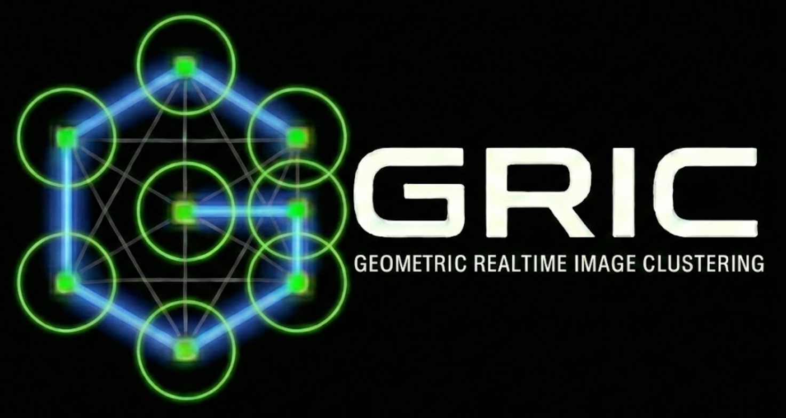

# GRIC: High-Speed Distance-Based Image & Stream Clustering

[](https://en.wikipedia.org/wiki/C17_(C_standard_revision))
[](https://cmake.org/)
[](LICENSE)
[](https://oguyon.github.io/gric-cluster/)

**GRIC** (Geometric Real-Time Image Clustering) is an ultra-fast, distance-based streaming clustering engine written in optimized C17. It groups data frames (images, camera streams, sensor logs) into clusters based on Euclidean distance thresholds ($r_{\text{lim}}$), reducing distance calculations from $O(K)$ to $O(1 \sim 3)$ per frame via active information-theoretic target selection and multi-point metric space pruning.

---

## 🎬 Video Walkthrough & Interactive Simulator

Experience GRIC through our narrated HD explainer video or explore algorithms in real-time in your browser:

- 🌐 **[Launch Interactive 2D & 3D Simulator](https://oguyon.github.io/gric-cluster/visual_simulator.html)**
- 📖 **[Read Full MkDocs Documentation](https://oguyon.github.io/gric-cluster/)**
- 📐 **[Visual Architecture & Algorithm Guide](https://oguyon.github.io/gric-cluster/algorithm/visual_guide/)**
- 🎥 **[Download / Watch Full Narrated HD Video (MP4)](docs/figures/gric_explainer.mp4)**


*Figure 1: Narrated visual walkthrough demonstrating sequential stream ingestion, boundary anchor creation, triangle inequality pruning, spiral center Shannon entropy gain, prior layers, and multi-tile rich joint tuples.*

---

## 🚀 Key Features & Architectural Innovations

### 1. 5-Stage Sequential Pipeline
GRIC clusters incoming frames sequentially in a single pass without storing dense pairwise distance matrices.


1. **Prior Normalization**: Ingests incoming frames from files or shared memory (`ImageStreamIO`) and layers Markov transition probabilities (`-tm`) and trajectory predictors (`-pred`).
2. **Target Selection**: Chooses the next candidate anchor to evaluate via Greedy priority or expected Shannon entropy minimization (`-entropy`).
3. **SIMD Metric Evaluation**: Computes Euclidean distance using AVX2 SIMD intrinsics and OpenMP multi-threading (`-ncpu`).
4. **Multi-Point Pruning**: Evaluates triangle inequality and higher-order simplex bounds to mathematically eliminate incompatible candidate clusters with **zero distance computations**.
5. **Assignment & Boundary Spawning**: Re-allocates matching frames ($d \le r_{\text{lim}}$) or spawns new exemplar cluster anchors directly on the boundary when all existing cluster matches fail.

---

### 2. Multi-Point Geometric Pruning


| Mode | CLI Flag | Geometric Principle | Speedup / Savings |
| :--- | :--- | :--- | :--- |
| **3-Point (1D Baseline)** | *Default* | $|d(f, cA) - d(cA, cX)| > r_{\text{lim}} \implies cX \text{ pruned}$ | **50% - 80% distance call drop** |
| **4-Point (2D Triangulation)** | `-te4` | Triangulates 2D baseline offset and orthogonal height $h_f$ | **+10% - 20% additional pruning** |
| **5-Point (3D Simplex)** | `-te5` | Simplex base plane projection and orthogonal 3D height $h_{\text{3D}}$ | **+15% - 30% additional pruning** |
| **Sparse DCC Bounds** | `-sparse_dcc` | Maintains dynamic interval bounds $[d_{\text{min}}, d_{\text{max}}]$ | **Eliminates $O(K^2)$ matrix memory** |

---

### 3. Information-Theoretic Target Selection (`-entropy`)


- **Greedy Mode (Default)**: Tests candidate anchors in descending order of prior probability.
- **Entropy Mode (`-entropy`)**: Schedules the pivot anchor that minimizes expected posterior Shannon entropy:
  $$H(X \mid \text{measure } c_j) = P(\text{match}) \cdot 0 + P(\text{mismatch}) \cdot H(X \mid \text{mismatch})$$
- **Spiral Center Pivot**: On non-linear manifolds like the benchmark 2D spiral, measuring distance to the center directly yields the radius, **unambiguously resolving the exact trajectory position in 1 measurement**.

---

### 4. Prior Modeling & Topological Learning


- **Markov Transitions (`-tm <coeff>`)**: Learns pairwise cluster transition probabilities over time.
- **Sequence Predictor (`-pred [len,h,n]`)**: Scans historical assignment logs to forecast multi-step paths.
- **Visitor Geometry (`-gprob`)**: Discovers manifold topology by cross-correlating co-measurement visitors.
- **Soft Bayesian Likelihoods (`-soft_bayesian`)**: Smooth Gaussian likelihood fading for noisy sensor streams.

---

### 5. Multi-Tile Parallelism & Rich Joint Tuples (`-tiles`, `-jtf`)


- **Spatial Tiling (`-tiles NxM`)**: Partitions high-dimension images into sub-tiles, maximizing CPU L1/L2 cache locality and parallelizing across OpenMP threads (`-ncpu`).
- **Rich Joint Tuples**: Produces joint cluster state tuples (e.g., `(c_0, c_3, c_2, c_1)`), capturing spatial cross-entropy across regions.
- **Joint Trajectory Fusion (`-jtf`)**: Pass 2 lookup matching against historical tuple trajectories resolves seam flickering while strictly verifying $d \le r_{\text{lim}}$.

---

## 🛠️ Programs & Tools

The GRIC suite includes several specialized CLI executables:

| Program | Role | Description |
| :--- | :--- | :--- |
| **`gric-cluster`** | **Core Tool** | Main clustering executable. Processes images, streams, videos, or ASCII coordinate tables. |
| **`gric-info`** | **Diagnostics** | Displays compile-time feature flags, library versions, and system paths. |
| **`gric-plot`** | **Visualization** | Generates publication-ready PNG and SVG summary plots of clustering manifolds and statistics. |
| **`gric-NDmodel`** | **Modeling** | Reconstructs N-dimensional coordinate geometries from distance matrices via Simulated Annealing. |
| **`gric-mktxtseq`** | **Test Data** | Generates synthetic coordinate benchmark sequences (2D/3D spirals, random walks, periodic circles). |
| **`gric-ascii-spot-2-video`**| **Simulation** | Converts coordinate trajectories into synthetic video files or shared memory streams. |
| **`gric-mkclusteredfile`** | **Post-processing** | Reconstructs clustered image cubes from input files and membership indices. |
| **`gric-stream-to-pipe`** | **Utility** | Pipes raw shared memory frames from `ImageStreamIO` to stdout for analysis. |

---

## 📦 Installation & Dependencies

### System Requirements (Debian / Ubuntu)

```bash
# Build essentials
sudo apt update
sudo apt install build-essential cmake pkg-config

# Optional scientific libraries (recommended for full capability)
sudo apt install libcfitsio-dev libpng-dev \
    libavformat-dev libavcodec-dev libswscale-dev libavutil-dev \
    libomp-dev
```

### Shared Memory Streaming (`ImageStreamIO` - Optional)

Required for ultra-low latency camera and sensor streaming:

```bash
git clone https://github.com/milk-org/ImageStreamIO.git
cd ImageStreamIO && mkdir build && cd build
cmake .. && make && sudo make install && sudo ldconfig
```

---

## 🔨 Build & Quick Start

```bash
# 1. Clone repository
git clone https://github.com/oguyon/gric-cluster.git
cd gric-cluster

# 2. Build binaries
mkdir build && cd build
cmake ..
make -j$(nproc)
```

### Verification & Feature Check

```bash
./gric-info
```

---

## ⚡ Recommended Presets & Examples


### 1. High-FPS Video Streams / Smooth Tracking
```bash
./gric-cluster a1.5 input.mp4 -tm 0.8 -pred 10,1000,2 -outdir out_video
```

### 2. High-Dimensional / Non-Linear Manifolds
```bash
./gric-cluster 0.45 input.fits -entropy -gprob -te5 -sparse_dcc -outdir out_manifold
```

### 3. Large Scientific Sensor Arrays ($512 \times 512$+)
```bash
./gric-cluster a1.2 input.fits -tiles 2x2 -jtf -ncpu 8 -outdir out_tiled
```

---

## 📚 Documentation

For full theoretical derivations, CLI flag descriptions, and benchmark reports, visit the **[GRIC Documentation Site](https://oguyon.github.io/gric-cluster/)**:

- 📖 **[Algorithm Overview & Modes](https://oguyon.github.io/gric-cluster/algorithm/)**
- 🎨 **[Visual Architecture & Explainer Guide](https://oguyon.github.io/gric-cluster/algorithm/visual_guide/)**
- ⌨️ **[Comprehensive CLI Option Manual](https://oguyon.github.io/gric-cluster/help/)**
- 📊 **[Benchmark Performance Suite](https://oguyon.github.io/gric-cluster/benchmarks/)**
- 🛰️ **[Real-World Earth Observation Demo](https://oguyon.github.io/gric-cluster/satellite_demo/)**

---

## 📄 License

This project is licensed under the MIT License - see the [LICENSE](LICENSE) file for details.
