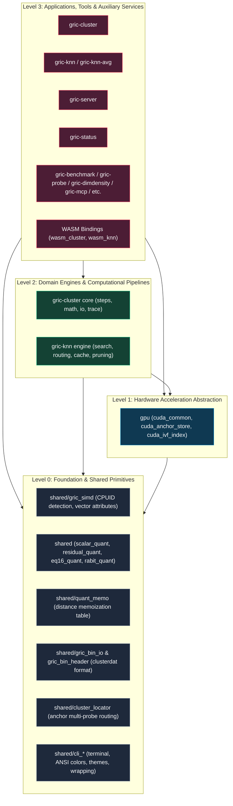
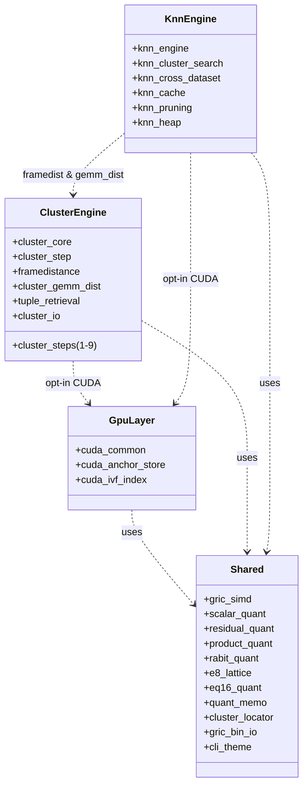

# Architecture & Module Dependency Graph

This document defines the architectural layers, public interfaces, and dependency hierarchy
for the `gric-cluster` codebase. All new code and refactorings must adhere to these layering
principles to prevent circular dependencies and maintain clean modular separation.

---

## Architectural Layers

The codebase is organized into four strictly ordered vertical tiers:

---

## Layer Definitions & Rules

### Level 0: Foundation & Shared Primitives (`src/shared/`)
- **Role**: Pure utility routines, hardware detection, binary file serialization, quantization
  algorithms (SQ8, SQ16, EQ16, RQ8, PQ, RaBitQ), memoization tables, and terminal formatting.
- **Constraints**:
  - Must **never** include headers from `src/gric-cluster/`, `src/gric-knn/`,
    `src/gpu/`, or any tool.
  - Headers must be self-contained and strictly declare only what is implemented in `src/shared/`.
  - Memory allocation inside core mathematical inner loops is strictly forbidden.

### Level 1: Hardware Acceleration Abstraction (`src/gpu/`)
- **Role**: Foundational CUDA memory managers, anchor storage buffers, and inverted file (IVF)
  metric indexing primitives.
- **Constraints**:
  - May depend on `src/shared/` (`gric_bin_header.h`, `gric_simd.h`).
  - Must **not** depend on higher-level engines (`gric-cluster` or `gric-knn`).
  - Core acceleration logic remains opt-in via `-DUSE_CUDA`.

### Level 2: Domain Engines & Computational Pipelines
- **Engines**:
  1. `src/gric-cluster/`:
     - `core/`: Main clustering coordinator, multi-tile orchestration, state management.
     - `steps/`: Isolated, single-responsibility per-frame execution steps.
     - `math/`: Distance metrics (`framedistance`), GEMM microkernels (`cluster_gemm_dist`),
       pruning, and tuple retrieval.
     - `io/`: Ingestion (ASCII, FITS, FFmpeg, ImageStreamIO) and artifact output writers.
     - `help/`: In-app markdown help rendering.
     - `trace/`: Profiling and event logging.
  2. `src/gric-knn/`:
     - `knn_engine`: Multi-threaded query dispatching and frame iteration.
     - `knn_cluster_search`: Intra- and inter-cluster member filtering and candidate ranking.
     - `knn_cross_dataset`: Trajectory tracking, basin expansion, and graph exploration.
     - `knn_cache`: Sidecar quantization caches (SQ8, SQ16, EQ16, RQ8, PQ) and layout builders.
     - `knn_pruning`: Metric pruning predicates (triangular inequalities, multi-pivot filters).
     - `knn_heap`: Fixed-capacity max-heaps with branchless sift-down operations.
- **Constraints**:
  - Shared math routines (such as `framedistance` and `cluster_gemm_dist`) belong to reusable
    compute libraries. `gric-knn` consumes them without circular entanglement.
  - Submodules within each engine interact solely through documented public header contracts.

### Level 3: Applications, Tools & Auxiliary Services
- Executables: `gric-cluster`, `gric-knn`, `gric-knn-avg`, `gric-server`, `gric-status`,
  `gric-benchmark`, `gric-probe`, `gric-mcp`, `gric-dimdensity`, `gric-tune`, `gric-info`, etc.
- **Constraints**:
  - Command-line parsing, output printing, and process management belong here.
  - No domain logic or math kernels should be implemented directly in application `main.c` files;
    they should delegate directly to Level 2 or Level 0 APIs.

---

## Detailed Component Dependency Map

---

## Architectural Rules & Enforcements

1. **No Circular Header Inclusions**:
   Headers must never form cyclic dependency chains. Use forward structure declarations
   wherever pointer references suffice.
2. **Implementation Belongs in `.c` Files**:
   Headers (`.h`) must contain only structure definitions, macros, and concise function prototypes.
   Heavy functions (>10 lines) must **never** be defined as `static inline` in public headers.
3. **No Dynamic Allocations in Critical Loops**:
   All buffers used during per-frame clustering or k-NN candidate scanning must be pre-allocated
   during setup/initialization inside state or scratch structures.
4. **Parameter Column Alignment**:
   All multi-line function declarations and prototypes must have their parameter names
   column-aligned according to `.agents/rules/parameter-alignment.md`.
5. **Lines Maximum 100 Characters**:
   Enforce the 100-character line length ceiling across all C sources, headers, and documentation.
