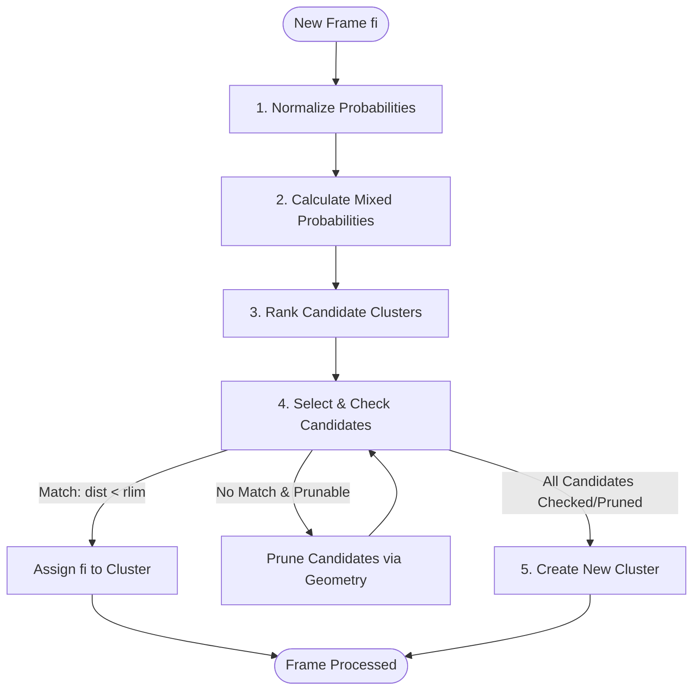

# Algorithm Overview & Modes

The GRIC clustering algorithm is designed for high-speed, sequential distance-based clustering. It
processes incoming data frames one by one, grouping them into clusters defined by **anchor frames**
under a maximum distance constraint (`rlim`).

## High-Level Workflow

For every new frame `fi` in a sequence, the algorithm performs the following overall steps:

### The 5 Core Steps

1.  **Normalize Probabilities**: Normalize the prior assignment probabilities `prob(cj)` of existing
    clusters so they sum to 1.0.
2.  **Calculate Mixed Probabilities**: If temporal prediction is active, mix the prior probabilities
    with the transition matrix probabilities:
    `P_mixed(cj) = (1 - coeff) * prob(cj) + coeff * P_trans(cj)`.
3.  **Rank Candidate Clusters**: Sort the existing clusters to determine the initial search order.
    If geometrical probability (`-gprob`) is active, candidates are ranked using the combined
    probability `P_mixed(cj) * gprob(fi, cj)`.
4.  **Select & Check Candidates**: Iterate through candidates using either **Greedy** or
    **Entropy** target selection:
    - Compute the distance `dfc(fi, cj)` to the candidate anchor.
    - If `dfc < rlim`, assign the frame to this cluster and update transition/recency probabilities.
    - If `dfc > rlim`, use geometric pruning to eliminate other impossible candidate clusters.
5.  **Create New Cluster**: If all existing candidate clusters are checked or pruned, establish a new
    cluster with `fi` as its anchor.

---

## Target Selection Modes: Greedy vs. Entropy

A key performance factor in GRIC is deciding *which* cluster to measure next during Step 4. GRIC
offers two primary modes for target selection:

### 1. Greedy Mode (Default)
In Greedy Mode, the algorithm selects targets solely by prioritizing the most likely match first:
- **Standard Greedy (no `-gprob`)**: It sequentially checks candidates in a static order sorted by
  prior probability.
- **Dynamic Greedy (with `-gprob`)**: It dynamically updates the candidates' geometrical probability
  after each distance measurement and selects the candidate with the highest combined probability
  (`P_mixed * current_gprobs`).

**Advantage**: Very low computation overhead per step. It works exceptionally well when there is a
high-probability candidate (e.g., in continuous streams with high temporal correlation).

---

### 2. Entropy Mode (`-entropy`)
In Entropy Mode, instead of greedily testing the most likely candidate, the algorithm treats target selection as an information-theory optimization problem:

- If a candidate cluster has a combined probability **greater than 0.5**, it is checked immediately.
- Otherwise, it evaluates a subset of active candidates (up to `-entropy_max_targets`, default 15)
  and calculates the **Expected Shannon Entropy** of the posterior probability distribution:
  
  \[
  H(X | \text{measure } c_j) = P(\text{match}) \cdot H(X | \text{match}) + P(\text{mismatch}) \cdot H(X | \text{mismatch})
  \]

- **Match Scenario**: If the measurement is a match, the search terminates (entropy falls to 0).
- **Mismatch Scenario**: If the measurement is a mismatch, the candidate is eliminated, and others
  may be pruned via geometric constraints, reducing the probability distribution to the remaining active set.
- The algorithm selects the target candidate that **minimizes** the expected Shannon entropy (maximizing information gain per distance calculation).

**Advantage**: Significantly reduces the number of expensive distance computations in high-dimensional
or noisy datasets where simple greedy paths struggle.

---

### Synergy and Complementarity

`gprob` (Geometrical Probability) and `-entropy` (Shannon Entropy Optimization) are highly
complementary because they handle different roles in the target selection process:

- **`gprob` acts as a probability generator**: It calculates the spatial probability distribution
  based on geometric similarity and historical co-measurements. It answer the question:
  *Where is the frame likely located in space?*
- **`-entropy` acts as a decision-theoretic scheduler**: It utilizes the probability distribution
  provided by `gprob` to calculate the expected Shannon information gain. It answers the question:
  *Which cluster anchor should I measure next to minimize search ambiguity as fast as possible?*

When both are enabled, `gprob` dynamically updates and refines the candidates' likelihoods after
each distance calculation, and `-entropy` uses this fresh distribution to schedule the next optimal
anchor to query. This synergistic relationship reduces the number of expensive metric evaluations
to a theoretical minimum.

---

## Detailed Components

Explore the technical details of the sub-components:
*   **[Geometric Pruning Mechanisms](pruning.md)**: How the triangle inequality, 4-point, and
    5-point pruning eliminate candidates.
*   **[Probability & Prediction Models](prediction.md)**: Details on transition matrices,
    temporal sequence forecasting, and geometric match probabilities.
