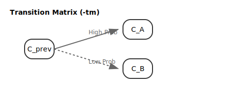

# Probability & Prediction Models

To minimize search steps and accelerate target identification, GRIC integrates models to learn and
forecast data patterns over time.

---

## 1. Transition Matrix Mixing (`-tm`)

For structured sequences (such as video scenes or cyclic processes), cluster transitions often follow
predictable patterns. The `-tm <coeff>` option leverages this by building a Markov-like transition model.

### Mechanism
- **Transition Count**: The algorithm maintains a matrix `tm(from, to)` counting how often cluster
  `from` transitions to cluster `to`.
- **Probability Mixing**: When ranking candidates for the next frame, the transition probability is
  mixed with the standard recency probability:
  
  \[
  P_{\text{mixed}}(c_j) = (1 - \text{coeff}) \cdot \text{prob}(c_j) + \text{coeff} \cdot P_{\text{trans}}(c_j)
  \]

- **Weight (`coeff`)**: Configured from `0.0` to `1.0`. A higher weight relies more heavily on the
  transition history from the previous frame.

---

## 2. Geometrical Match Probability (`gprob`)

When processing a frame `m`, GRIC compares its partial distance measurements against the history of
already processed frames `k` to update a **Geometrical Probability** `gprob(m, cl)` for each cluster.

### The `FrameInfo` History
For each processed frame `k`, the algorithm stores:
- `cluster_indices`: Clusters for which distance was computed.
- `distances`: The corresponding measured distances.
- `assignment`: The final cluster ID assigned.

### Computing Geometrical Match `gmatch(m, k)`
If frame `m` and a historical frame `k` have both measured a distance to the same cluster `c`,
we calculate how closely their distances match:

1.  **Normalized Difference**:
    `dr = |dist(m, c) - dist(k, c)| / rlim`
2.  **Match Factor `fmatch(dr)`**:
    - If `dr > 2.0`: `0.0` (Triangle inequality violation; they cannot share a cluster).
    - If `dr <= 2.0`: `a - (a - b) * dr / 2`
      - `a` (default 2.0): Reward for exact match (`dr = 0`).
      - `b` (default 0.5): Penalty limit value (`dr = 2`).

The total `gmatch(m, k)` is the product of `fmatch(dr)` over all shared clusters.

### Updating `gprob`
For each historical frame `k` sharing measurements with `m`:
- Let `target = assignment[k]`.
- Update: `gprob(m, target) *= gmatch(m, k)`.

Clusters with high geometrical probability are prioritized for checking, reducing unnecessary distance
computations.

---

## 3. Sequence-based Prediction (`-pred`)

For time-series forecasting, the `-pred[len,h,n]` option allows the algorithm to detect repeating sequence patterns in assignment history.

### Workflow
1.  **Pattern Identification**: Read the cluster assignments of the last `len` frames (default 10).
2.  **History Scan**: Scan the assignments of the last `h` frames (default 1000) to find matching
    sequences.
3.  **Frequency Analysis**: For all occurrences of the pattern, count which cluster followed them.
4.  **Bypassed Search**: The top `n` (default 2) most frequent "next clusters" are checked **first**,
    bypassing the standard probability ranking entirely.

If a predicted cluster matches (`dist < rlim`), the frame is assigned immediately, skipping the entire
ranking and search process.
