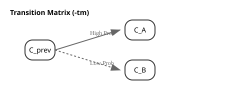

# Probability & Prediction Models

To minimize search steps and accelerate target identification, GRIC integrates models to learn and
forecast data patterns over time.

---

## 1. Transition Matrix Mixing (`-tm`)

For structured sequences (such as video scenes or cyclic processes), cluster transitions often
follow predictable patterns. The `-tm <coeff>` option leverages this by building a Markov-like
transition model.

### Mechanism
- **Transition Count**: The algorithm maintains a matrix `tm(from, to)` counting how often cluster
  `from` transitions to cluster `to`.
- **Probability Mixing**: When ranking candidates for the next frame, the transition probability is
  mixed with the standard recency probability:
  
  \[
  P_{\text{mixed}}(c_j) = (1 - \text{coeff}) \cdot \text{prob}(c_j)
                        + \text{coeff} \cdot P_{\text{trans}}(c_j)
  \]

- **Weight (`coeff`)**: Configured from `0.0` to `1.0`. A higher weight relies more heavily on the
  transition history from the previous frame.

---

## 2. Geometrical Match Probability (`-gprob`)

When a distance measurement to cluster anchor `cj` is taken, GRIC updates the **Geometrical
Probability** `current_gprobs` and posterior `entropy_p_current` of candidate clusters based on
historical visitor co-measurements.

### The `FrameInfo` History
For each processed frame `k`, the algorithm stores:
- `cluster_indices`: Clusters for which distance was computed.
- `distances`: The corresponding measured distances.
- `assignment`: The final cluster ID assigned.

### Incremental Visitor Matching
When anchor `cj` is measured with distance `dfc(fi, cj)`:
1. **Retrieve Visitors**: Look up historical frames `k` that also measured distance to `cj`.
2. **Normalized Distance Difference**:
   `dr = |dfc(fi, cj) - dist(k, cj)| / rlim`
3. **Match Factor `fmatch(dr)`**:
   - If `dr > 2.0`: `0.0` (Triangle inequality violation; points cannot belong to same cluster).
   - If `dr <= 2.0`: `a - (a - b) * dr / 2.0`
     - `a` (default 2.0, `-fmatcha`): Reward for exact match (`dr = 0`).
     - `b` (default 0.5, `-fmatchb`): Penalty at the boundary (`dr = 2`).
4. **Update Posteriors**:
   For each visitor `k`, let `target_cl = assignment[k]`. If `target_cl` is still active:
   `current_gprobs[target_cl] *= val`
   `entropy_p_current[target_cl] *= val`

If multiple historical visitors of `cj` were assigned to `target_cl`, their match factors accumulate
multiplicatively. High geometrical likelihoods guide both dynamic greedy and entropy schedulers.

---

## 3. Sequence-based Prediction (`-pred` and `-predf`)

For time-series forecasting, GRIC provides two complementary sequence prediction modes:
binary pattern matching (`-pred`) and fuzzy geometric trajectory similarity (`-predf`).

### Binary Prediction Mode (`-pred[len,h,n]`, Default Mode 1)
Designed for repeating deterministic sequences (e.g. periodic orbits, fixed cycles):
1. **Pattern Identification**: Read cluster assignments of the last `len` frames (default 10).
2. **History Scan**: Scan the assignments of the last `h` frames (default 1000) for identical
   subsequences matching the pattern.
3. **Frequency Analysis**: For all occurrences of the pattern, tally which cluster followed them.
4. **Bypassed Search**: The top `n` (default 2) candidate cluster IDs are tested **first**,
   bypassing the standard probability ranking entirely.

If a predicted cluster matches (`dist < rlim`), the frame is assigned immediately, skipping the
search loop.

### Fuzzy Prediction Mode (`-predf[len,h,n]`, Mode 2)
Designed for continuous or noisy trajectories where exact cluster ID sequences may diverge:
1. **Trajectory Matching**: For each historical step within lookback window `h`, computes a
   continuous similarity metric $m_{AB}$ comparing past frame-to-anchor distances and
   inter-cluster bounds ($d_{cc}$):
   \[
   m_{AB} = \exp\left(
       -\frac{\sum_{j=0}^{\text{len}-1} (1 - 1/\text{len})^j (d_{\max} / r_{\text{lim}})}
             {\text{len} \cdot (1 - 1/e)}
   \right)
   \]
   where $d_{\max} = d_A + d_B + d_{cc}$.
2. **Prior Probability Blending**: Aggregates match scores across history to form a prediction
   distribution $P_{\text{seq}}$, which is multiplied with the frequency prior:
   \[
   P_{\text{mixed}}(c_i) = \frac{P_{\text{freq}}(c_i) \cdot P_{\text{seq}}(c_i)}
                                {\sum_j P_{\text{freq}}(c_j) \cdot P_{\text{seq}}(c_j)}
   \]
