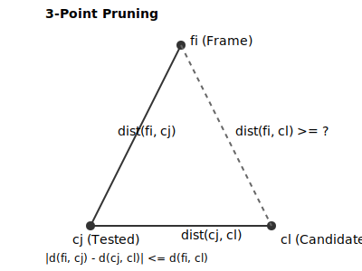
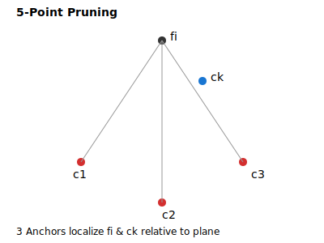

# Geometric Pruning Mechanisms

The core optimization in GRIC to avoid expensive distance calculations (`framedist` calls) is
**geometric pruning**. By leveraging the metric properties of Euclidean space, the algorithm can
geometrically prove that a candidate cluster cannot contain the current frame without actually
calculating the distance to its anchor.

---

## 1. Triangle Inequality (3-Point Pruning)

Standard 3-point pruning is applied to every active candidate cluster. It uses a single measured
distance to a cluster anchor to establish a lower bound for all other candidates.

```
       [fi (Current Frame)]
           /         \
   dfc(fi, cj)     (dist >= lower_bound)
         /             \
      [cj] ----------- [cl (Candidate)]
            dcc(cj, cl)
```

### Mathematical Rule
For the current frame `fi`, an already measured cluster anchor `cj`, and an unmeasured candidate
cluster anchor `cl`:

\[
\text{dist}(f_i, c_l) \ge | \text{dfc}(f_i, c_j) - \text{dcc}(c_j, c_l) |
\]

If the lower bound is greater than the cluster radius limit (`rlim`), then `cl` is pruned:

\[
| \text{dfc}(f_i, c_j) - \text{dcc}(c_j, c_l) | > \text{rlim} \implies c_l \text{ is pruned}
\]



---

## 2. 4-Point Pruning (`-te4`)

When 4-point pruning is enabled, the algorithm uses **two** previously measured cluster anchors
(`c1`, `c2`) relative to the current frame `fi` to prune an unmeasured candidate `ck`.

### Mathematical Logic
By knowing `dist(fi, c1)`, `dist(fi, c2)`, and the inter-cluster distances between `c1`, `c2`,
and `ck`, the algorithm defines a tighter geometric bounding region for `fi` in the subspace.
It computes the minimum possible Euclidean distance `dist(fi, ck)` under these constraints.
If this minimum bound exceeds `rlim`, the candidate `ck` is pruned.

This is more restrictive than standard 3-point pruning but introduces a small algebraic overhead.

---

## 3. 5-Point Pruning (`-te5`)

When 5-point pruning is enabled, the algorithm uses **three** previously measured cluster anchors
(`c1`, `c2`, `c3`) relative to the current frame `fi` to prune an unmeasured candidate `ck`.



### Mathematical Logic
1.  **Coordinate Reconstruction**: The three measured anchors (`c1`, `c2`, `c3`) form a local 2D
    triangle (or 3D simplex) in space.
2.  **Triangulation Bounds**: Using the known distances `dist(fi, c1)`, `dist(fi, c2)`, and
    `dist(fi, c3)`, the algorithm establishes a local coordinate system to calculate the exact
    bounds of `fi`'s position.
3.  **Orthogonal Projection Bound**: It calculates the minimum possible distance from `fi` to `ck`.
    This represents a multi-dimensional intersection boundary.

### Performance Trade-off
- **Reduction in calls**: Reduces distance computations by up to **45%** on complex high-dimensional
  datasets.
- **CPU Overhead**: Involves solving small linear/quadratic systems (triangulation math). If the
  distance metric calculation (`framedist`) is very expensive (high dimensionality), this is a significant net win.
