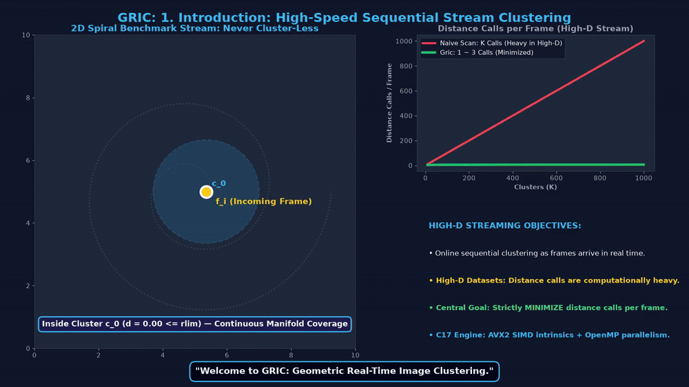
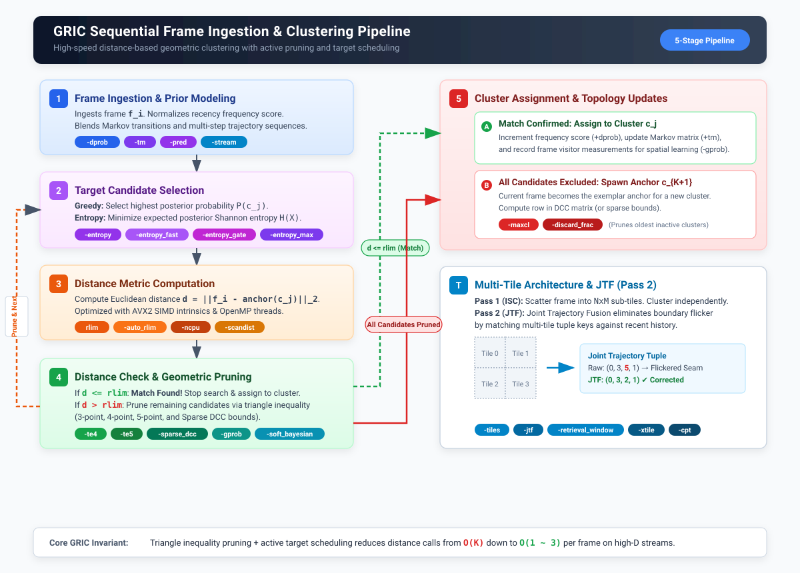
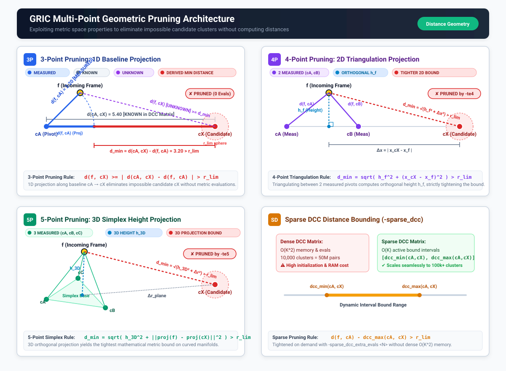
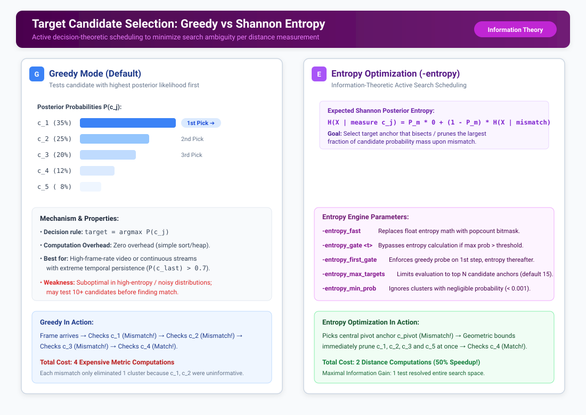
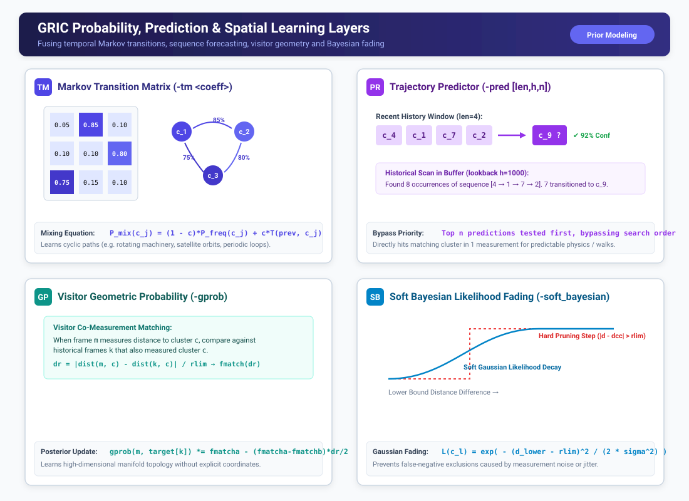
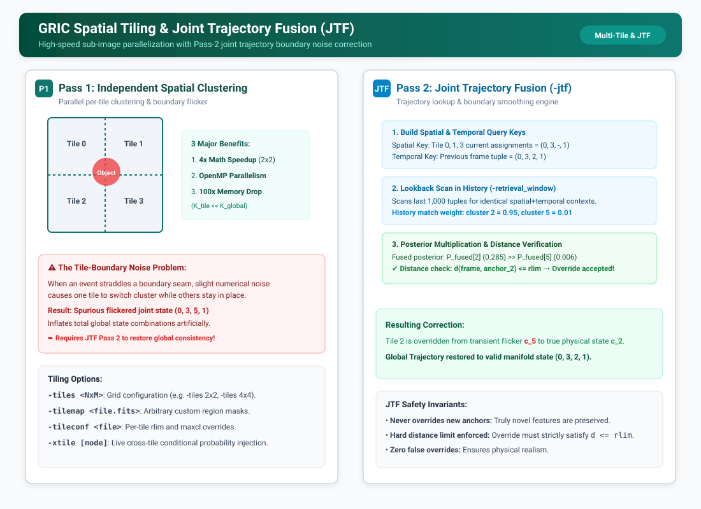
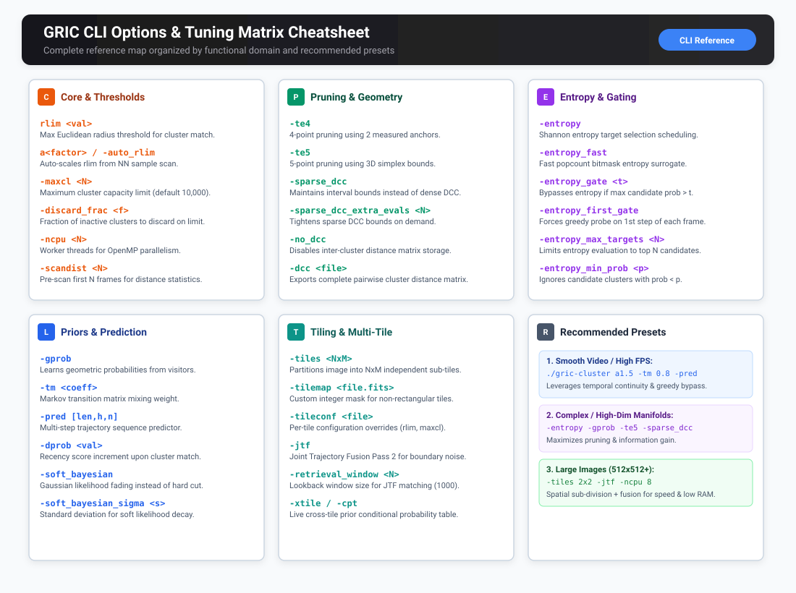

# GRIC Visual Architecture & Options Guide

This guide provides a comprehensive visual walkthrough of the **GRIC** (Geometric Real-Time Image Clustering) algorithm and its complete suite of performance options.

---

## 1. Interactive 2D Simulator & Narrated Video Explainer

Experience GRIC in real-time in your browser or watch the in-depth narrated video walkthrough:

<div style="display: flex; gap: 15px; margin: 20px 0; flex-wrap: wrap;">
  <a href="../visual_simulator.html" target="_blank" style="background: #2563eb; color: #ffffff; padding: 10px 18px; border-radius: 8px; text-decoration: none; font-weight: 600; display: inline-flex; align-items: center; gap: 8px;">
    &#9658; Launch Interactive 2D Simulator
  </a>
  <a href="../figures/gric_explainer.mp4" target="_blank" style="background: #0d9488; color: #ffffff; padding: 10px 18px; border-radius: 8px; text-decoration: none; font-weight: 600; display: inline-flex; align-items: center; gap: 8px;">
    &#9654; Download / Watch HD Video with Voiceover (MP4)
  </a>
</div>


*Animation: In-depth narrated walkthrough demonstrating (1) sequential stream ingestion, (2) anchor creation, (3) multi-point geometric pruning, (4) Shannon entropy scheduling, (5) prior learning layers, and (6) multi-tile Joint Trajectory Fusion (JTF).*

### Video Scene Breakdown
1. **Scene 1: Introduction: Sequential High-D Stream Clustering**: Real-time clustering on high-dimensional streams where distance evaluation is the primary bottleneck; strictly minimizes evaluations per frame ($O(K) \to O(1\sim 3)$) along the 2D spiral benchmark.
2. **Scene 2: Cluster Allocation, Dynamic Streams & Boundary Spawning**: Real-time growing member count bar plot; tests existing clusters first; continuous back-and-forth trajectory demonstrating cluster reuse and boundary anchor spawning only when $d > r_{\text{lim}}$.
3. **Scene 3: Geometric Pruning via the Triangle Inequality**: Simple synchronized single-triangle breakdown showing measured vs known edges, lower bound computation, candidate pruning, and multi-point extensions to 4-point (`-te4`) and 5-point (`-te5`) simplex height bounds.
4. **Scene 4: Target Selection (Greedy vs Shannon Entropy)**: Active information gain maximization (`-entropy`); 2D spiral center pivot measurement unambiguously solves manifold position in 1 measurement and collapses dynamic in-memory priors.
5. **Scene 5: Priors & Topological Learning**: Markov transition matrices (`-tm`), sequence predictor (`-pred`), visitor geometry (`-gprob`), and soft Gaussian fading (`-soft_bayesian`).
6. **Scene 6: Spatial Tiling & Joint Trajectory Fusion**: High-dimension image partitioning (`-tiles`), OpenMP multi-threading, cross-entropy spatial correlation, and rich joint cluster tuples `(0, 3, 2, 1)` with Pass 2 JTF correction (`-jtf`).
7. **Scene 7: Summary & CLI Presets**: Pipeline recap and tuned recipes for high-speed tracking and complex manifolds.

---

## 2. The 5-Stage Sequential Pipeline

GRIC processes incoming data frames one by one in a single pass. Instead of naively comparing a frame against every existing cluster ($O(K)$ work), GRIC uses active target scheduling and multi-point geometric bounds to identify matching clusters in **1 to 3 evaluations**.



### Pipeline Stages & Option Mapping

1. **Stage 1: Frame Ingestion & Prior Modeling**
   - Normalizes recency frequency priors.
   - Blends Markov transition probabilities (`-tm <coeff>`) and trajectory sequence forecasts (`-pred [len,h,n]`).
   - Supports streaming inputs via ImageStreamIO shared memory (`-stream <name>`).
2. **Stage 2: Target Candidate Selection**
   - **Greedy Mode (Default)**: Evaluates the candidate with the highest posterior probability $\arg\max P(c_j)$.
   - **Entropy Mode (`-entropy`)**: Schedules the target cluster anchor that minimizes expected posterior Shannon entropy $H(X)$, maximizing information gain per measurement.
3. **Stage 3: Distance Metric Computation**
   - Computes Euclidean distance $d(f_i, \text{anchor}(c_j))$ using SIMD AVX2 intrinsics and OpenMP multi-threading (`-ncpu <N>`).
4. **Stage 4: Distance Check & Multi-Point Pruning**
   - **If $d \le r_{\text{lim}}$**: Match confirmed! Terminates search and proceeds to assignment.
   - **If $d > r_{\text{lim}}$**: Exploits metric space constraints to eliminate incompatible candidates (3-point, 4-point `-te4`, 5-point `-te5`, and Sparse DCC bounds `-sparse_dcc`).
5. **Stage 5: Cluster Assignment & Anchor Spawning**
   - **Match**: Assigns frame to cluster $c_j$, updates visitor history (`-gprob`), and reinforces Markov transition counts.
   - **Exhausted**: Frame becomes the exemplar anchor for a new cluster $c_{K+1}$. Prunes inactive clusters if capacity is reached (`-maxcl`, `-discard_frac`).

---

## 3. Geometric Pruning & Distance Geometry

Geometric pruning allows GRIC to mathematically prove a candidate cluster cannot contain the current frame without ever computing the distance to its anchor.



| Mechanism | CLI Option | Mathematical Principle | Reduction in Distance Calls |
| :--- | :--- | :--- | :--- |
| **3-Point (Triangle Inequality)** | *Default* | $|d(f_i, cA) - d(cA, cX)| > r_{\text{lim}} \implies cX \text{ pruned}$ | **50% - 80%** |
| **4-Point (2 Measured Anchors)** | `-te4` | 2D triangulation baseline projection & orthogonal height $h_f$ | **+10% - 20% additional** |
| **5-Point (3D Simplex)** | `-te5` | 3D orthogonal simplex projection & height $h_{\text{3D}}$ | **+15% - 30% additional** |
| **Sparse DCC Bounding** | `-sparse_dcc` | Maintains dynamic interval bounds $[d_{\text{min}}, d_{\text{max}}]$ | Eliminates $O(K^2)$ matrix memory |

---

## 4. Target Selection: Greedy vs Shannon Entropy

Deciding *which* cluster to measure next determines how fast ambiguity is resolved:



### Expected Shannon Entropy Minimization

When `-entropy` is enabled, GRIC treats target selection as an information-theoretic optimization:

\[
H(X \mid \text{measure } c_j) = P(\text{match}) \cdot 0 + P(\text{mismatch}) \cdot H(X \mid \text{mismatch})
\]

- If a cluster has $P(c_j) > 0.5$, it is checked immediately.
- Otherwise, GRIC selects the anchor that prunes the greatest probability mass upon mismatch.
- **Adaptive Gating (`-entropy_gate <t>`)**: Bypasses entropy computation if confidence is already high.
- **Fast Surrogate (`-entropy_fast`)**: Uses popcount bitmasks for ultra-fast surrogate entropy evaluations.

---

## 5. Prior Layers & Spatial Learning

GRIC builds and refines cluster probabilities through four complementary layers:



1. **Recency Frequency Prior (`-dprob <val>`)**: Recently visited clusters receive higher prior weight.
2. **Markov Transition Matrix (`-tm <coeff>`)**: Learns pairwise transition probabilities $T(c_{\text{prev}} \to c_{\text{curr}})$. Ideal for rotating or cyclic processes.
3. **Multi-Step Trajectory Predictor (`-pred [len,h,n]`)**: Detects repeating multi-frame trajectory patterns in historical assignment logs and tests top predictions first.
4. **Visitor Co-Measurement Geometry (`-gprob`)**: Dynamically updates spatial likelihoods by comparing partial measurements against historical frame visitors.
5. **Soft Bayesian Fading (`-soft_bayesian`)**: Replaces hard threshold cutoffs with smooth Gaussian likelihood decay to tolerate sensor noise and jitter.

---

## 6. Multi-Tile Architecture & Joint Trajectory Fusion (JTF)

For large images ($512 \times 512$+), spatial tiling provides substantial speedups and drastic memory reductions:



### Two-Pass Multi-Tile Workflow

- **Pass 1: Independent Spatial Clustering (ISC)**
  - Subdivides the image into an $N \times M$ grid (`-tiles <NxM>`) or custom regions (`-tilemap <file.fits>`).
  - Each tile runs an independent GRIC clustering instance in parallel using OpenMP threads.
- **Pass 2: Joint Trajectory Fusion (`-jtf`)**
  - **The Problem**: Physical features crossing tile seams cause slight numerical noise to flip one tile's cluster, creating a spurious "flickered" joint tuple (e.g. `(0, 3, 5, 1)`).
  - **The Solution**: JTF scans recent tuple history (`-retrieval_window <N>`) for matching spatial-temporal patterns and overrides the outlier tile (correcting to `(0, 3, 2, 1)`).
  - **Safety Guarantee**: Overrides are only accepted if the sub-frame distance satisfies the hard threshold $d \le r_{\text{lim}}$.

---

## 7. Options Cheatsheet & Tuning Matrix



### Recommended Parameter Recipes

```bash
# 1. Smooth Video Streams / High FPS Tracking
./gric-cluster a1.5 input.mp4 -tm 0.8 -pred 10,1000,2 -outdir out_video

# 2. Complex / High-Dimensional Manifolds
./gric-cluster 0.45 input.fits -entropy -gprob -te5 -sparse_dcc -outdir out_manifold

# 3. High-Resolution Scientific Sensors (512x512+)
./gric-cluster a1.2 input.fits -tiles 2x2 -jtf -ncpu 8 -outdir out_tiled
```
