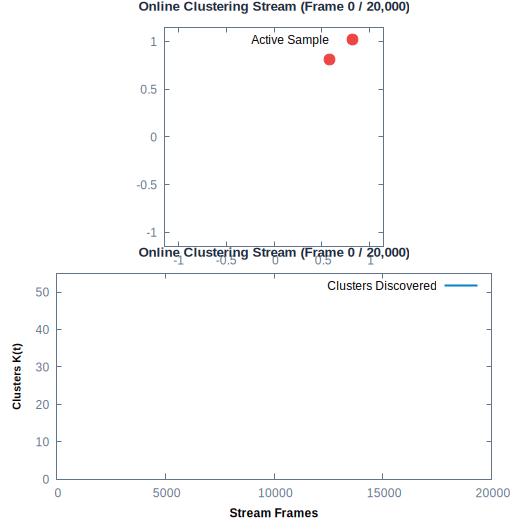
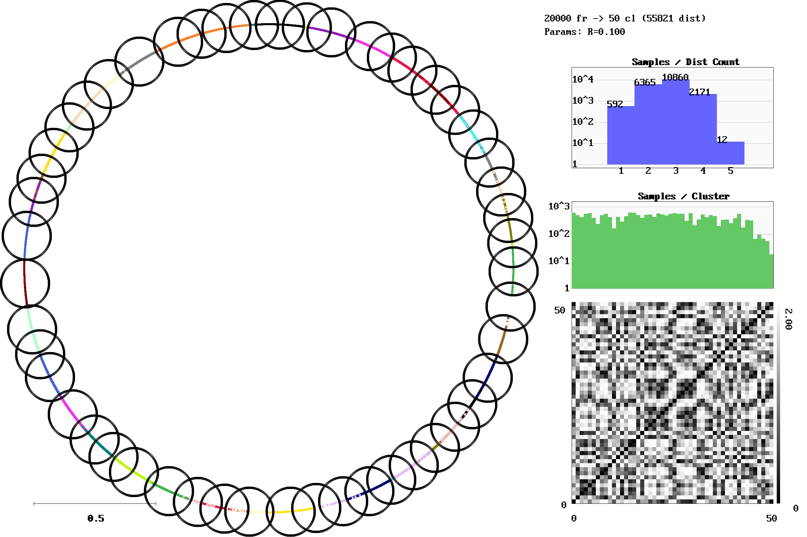
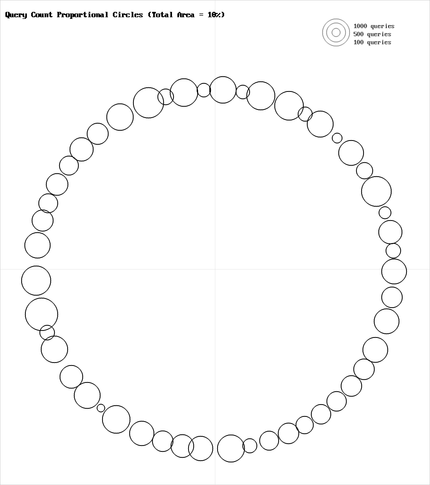
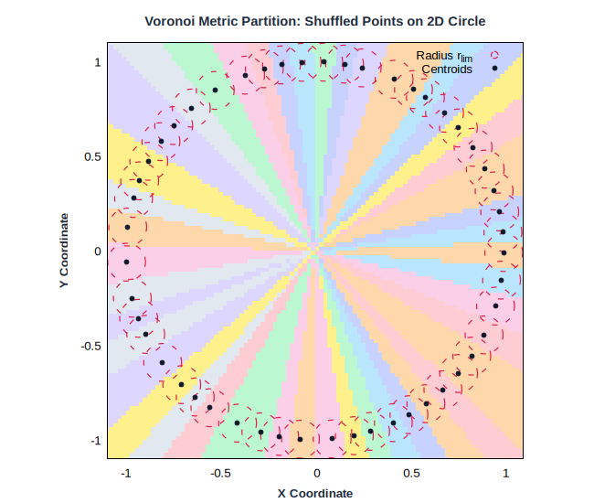
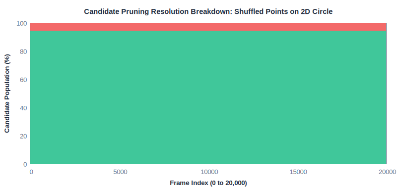
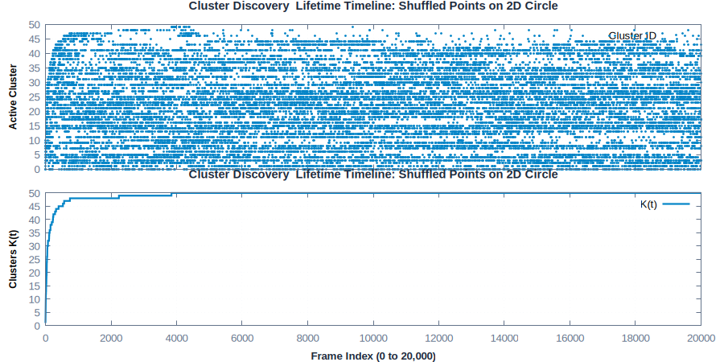
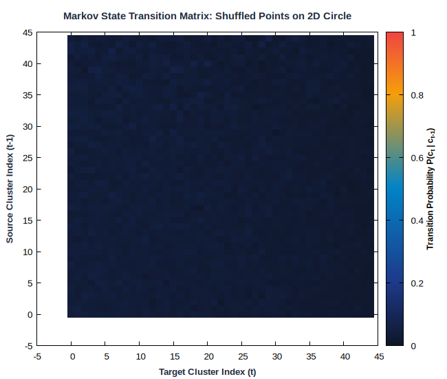
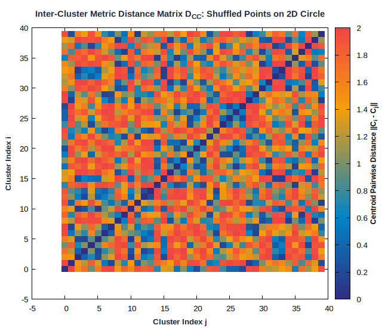
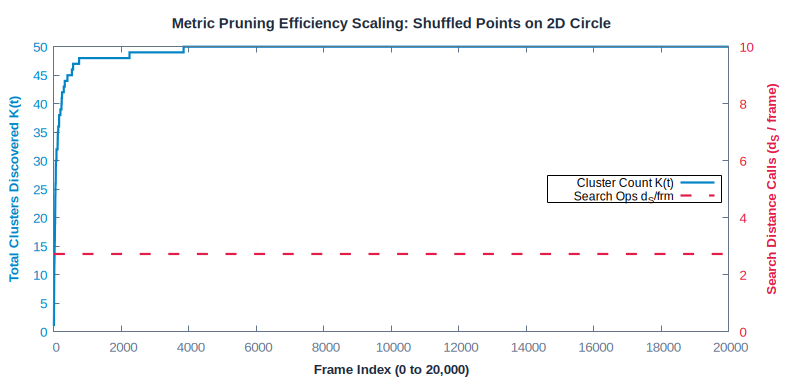

# Shuffled Points on 2D Circle

**Category**: 2D Trajectories  
**Data Type**: `txt` (20,000 frames)  
**Clustering Parameter**: `rlim = 0.10`

---

## Scenario Overview

Points randomly sampled from a 1D circular manifold embedded in 2D Euclidean space with
temporal order shuffled. Tests geometric solving and metric space pruning without sequential
correlation.

## Online Stream Clustering Animation

The looping animation below traces online cluster discovery and sample streaming over time:



## Spatial Diagnostics (`gric-plot`)

Below is the visualization generated by `gric-plot` showing the sample manifold,
cluster centroids with radius threshold circles ($r_{\text{lim}}$),
distance call distribution, and cluster size histogram:



### Query & Candidate Ranking Diagnostics



## Voronoi Metric Space Tessellation & Receptive Fields

The Voronoi diagram partitions the 2D feature space into discrete cluster basins overlaid
with the circumscribed radius boundary circles ($r_{\text{lim}}$):



## Candidate Pruning Resolution Breakdown

Stacked area chart illustrating how candidate clusters are resolved on every frame:



## Temporal Dynamics & Cluster Discovery

The timeline below traces active cluster assignments across the 20,000-frame sequence alongside
the cumulative discovery rate ($K(t)$):



## Markov State Transition Matrix ($P(c_t \mid c_{t-1})$)

The transition probability matrix shows the probability flow between states:



## Inter-Cluster Metric Distance Matrix ($D_{CC}$)

Pairwise Euclidean distances between all cluster centroids ($K \times K$):



## Metric Pruning Efficiency Scaling

The chart below demonstrates how candidate distance operations stay flat despite growth in $K$:



## Execution Commands

### 1. Data Generation
```bash
gric-mktxtseq 20000 2Dcircle-shuffle.txt 2Dcircle -shuffle
```

### 2. Clustering Execution
```bash
gric-cluster 0.10 -maxcl 2500 -maxim 20000 -outdir out_2Dcircle-shuffle -clustered \
2Dcircle-shuffle.txt
```

### 3. Diagnostic Visualization
```bash
gric-plot 2Dcircle-shuffle.txt out_2Dcircle-shuffle/cluster_run.log \
docs/benchmarks/images/2Dcircle-shuffle.png
```

## Performance Measurements

| Metric | Measured Value | Description |
| :--- | :--- | :--- |
| **Total Frames** | `20,000` | Number of sequential frames processed |
| **Execution Time** | `156.030 ms` | Total wall-clock runtime |
| **Throughput** | `128,180 fps` | Frames processed per second |
| **Active Clusters / States ($K$)** | `50` | Total distinct clusters created |
| **Sample Distances ($d_S$)** | `54,596` | Sample-to-cluster evaluations |
| **Search Calls ($d_S$ / frame)** | **`2.73`** | Search calls per frame |
| **Total Ops ($d$ / frame)** | **`2.79`** | Total distance ops per frame |
| **Pruning Speedup Factor** | **`18.3x`** | Acceleration over exhaustive search |
| **Distance Ops Saved** | **`94.5%`** | Percentage of pairwise calls pruned away |
| **Peak Memory** | `135,000 KB` | Peak resident set size (RSS) |

---

## Algorithmic Insights

Even with complete temporal shuffling, triangle inequality metric pruning allows nearby anchor
clusters to quickly bound candidate distances, pruning ~94% of candidate clusters and requiring
only **~2.72 sample distance evaluations per frame** across 46 clusters (a **16.9x speedup**).

---

[← Back to Benchmarks Overview](index.md)
