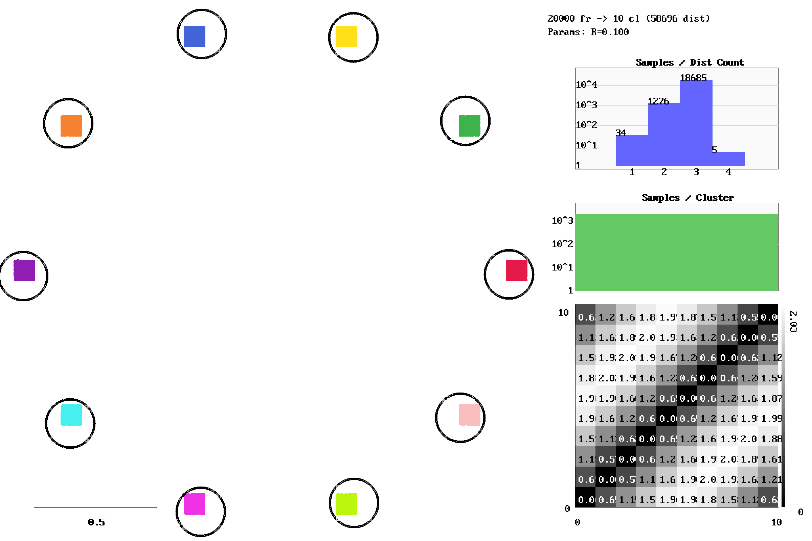
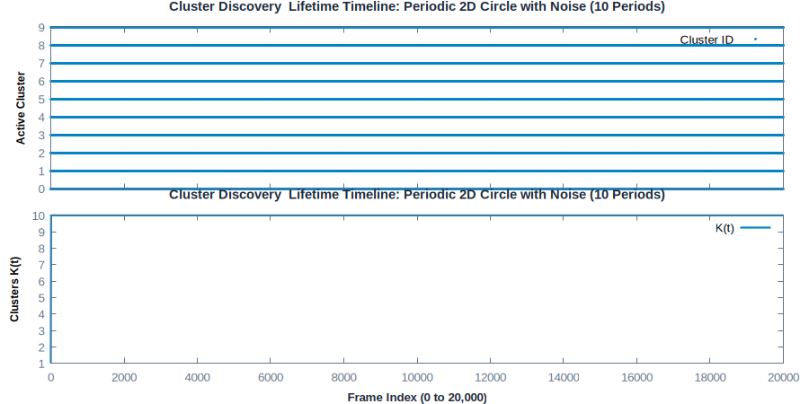
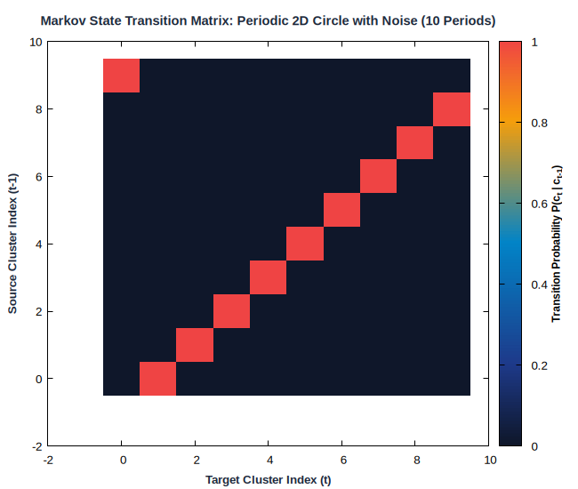
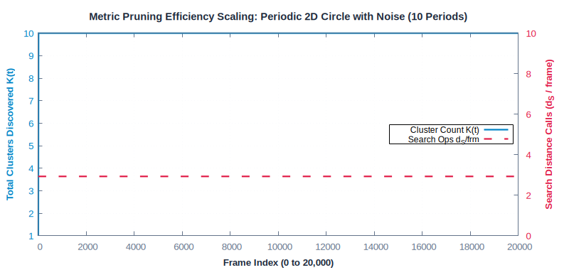

# Periodic 2D Circle with Noise (10 Periods)

**Category**: 2D Trajectories  
**Data Type**: `txt` (20,000 frames)  
**Clustering Parameter**: `rlim = 0.10`

---

## Scenario Overview

A repeating circular motion completing 10 full periodic cycles with additive Gaussian noise
(sigma=0.04). Tests cyclic recurrence and transition probability stability.

## Spatial Diagnostics (`gric-plot`)

Below is the visualization generated by `gric-plot` showing the sample manifold,
cluster centroids with radius threshold circles ($r_{\text{lim}}$),
distance call distribution, and cluster size histogram:



### Query & Candidate Ranking Diagnostics


## Temporal Dynamics & Cluster Discovery

The timeline below traces active cluster assignments across the 20,000-frame sequence alongside
the cumulative discovery rate ($K(t)$):



## Markov State Transition Matrix ($P(c_t \mid c_{t-1})$)

The transition probability matrix shows the probability flow between states:



## Metric Pruning Efficiency Scaling

The chart below demonstrates how candidate distance operations stay flat despite growth in $K$:



## Execution Commands

### 1. Data Generation
```bash
gric-mktxtseq 20000 2DcircleP10n.txt 2Dcircle10 -noise 0.04
```

### 2. Clustering Execution
```bash
gric-cluster 0.10 -maxcl 2500 -maxim 20000 -outdir out_2DcircleP10n -clustered \
2DcircleP10n.txt
```

### 3. Diagnostic Visualization
```bash
gric-plot 2DcircleP10n.txt out_2DcircleP10n/cluster_run.log \
docs/benchmarks/images/2DcircleP10n.png
```

## Performance Measurements

| Metric | Measured Value | Description |
| :--- | :--- | :--- |
| **Total Frames** | `20,000` | Number of sequential frames processed |
| **Execution Time** | `135.838 ms` | Total wall-clock runtime |
| **Throughput** | `147,233 fps` | Frames processed per second |
| **Active Clusters / States ($K$)** | `10` | Total distinct clusters created |
| **Sample Distances ($d_S$)** | `58,651` | Sample-to-cluster evaluations |
| **$d_S / \text{frame}$** | `**2.93**` | Search calls per frame |
| **Total $d / \text{frame}$** | `**2.93**` | Total distance ops per frame |
| **Pruning Speedup Factor** | `**3.4x**` | Acceleration over exhaustive search ($K / d_S$) |
| **Distance Ops Saved** | `**70.7%**` | Percentage of pairwise calls pruned away |
| **Peak Memory** | `135,000 KB` | Peak resident set size (RSS) |

---

## Algorithmic Insights

The 11-12 clusters forming the circle are rapidly established during the initial cycle. For all
subsequent cycles, incoming samples are classified in **~2.84 distance calls per frame** with
100% stable cluster recurrence.

---

[← Back to Benchmarks Overview](index.md)
