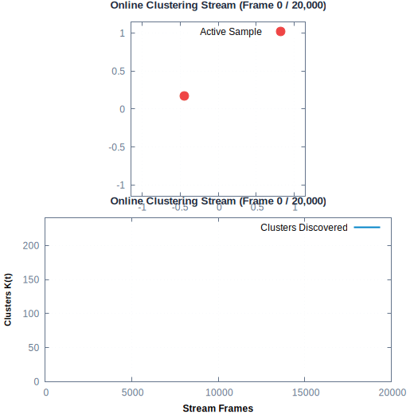
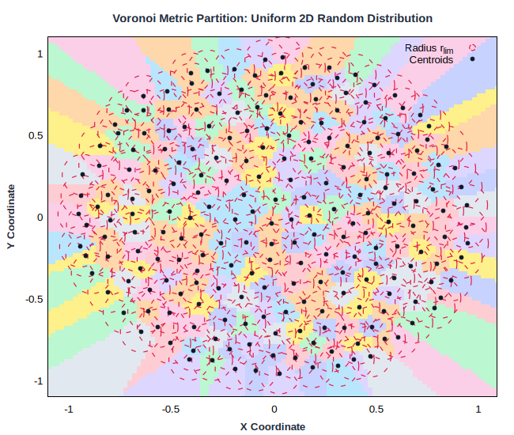
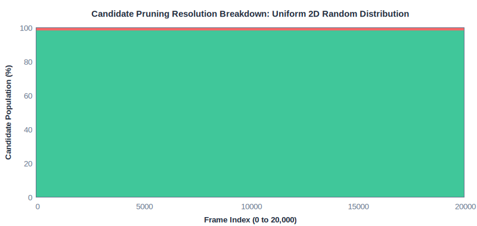
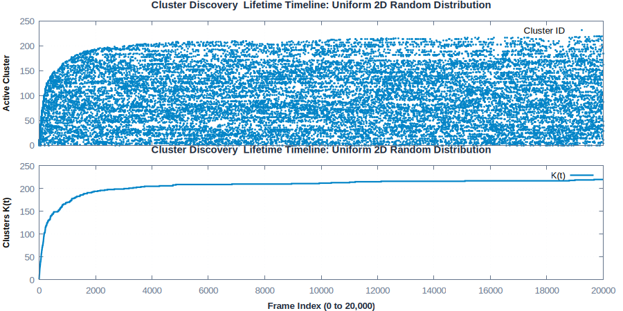
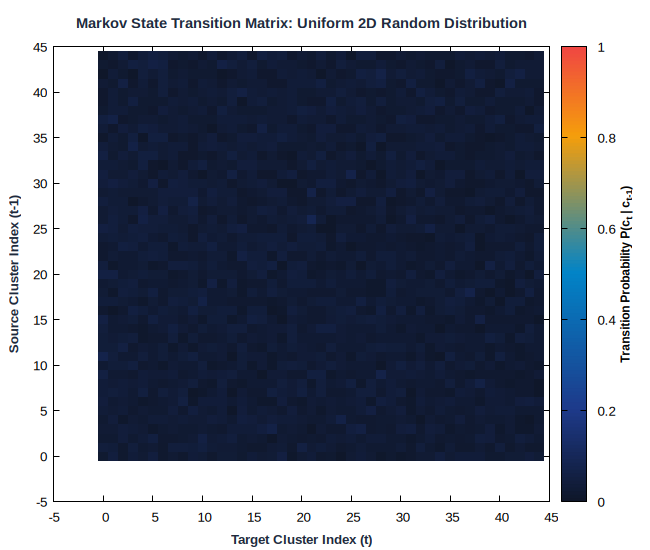
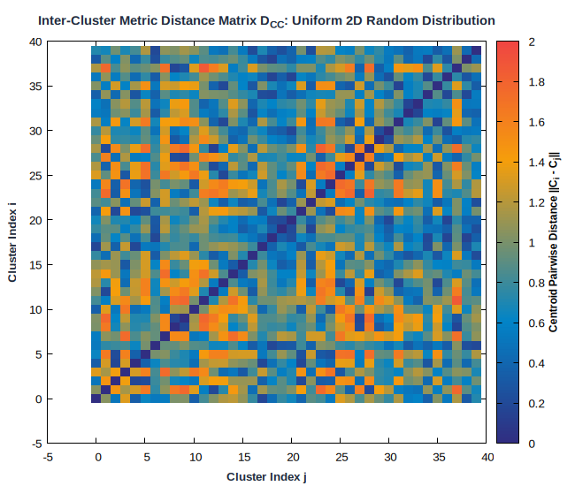
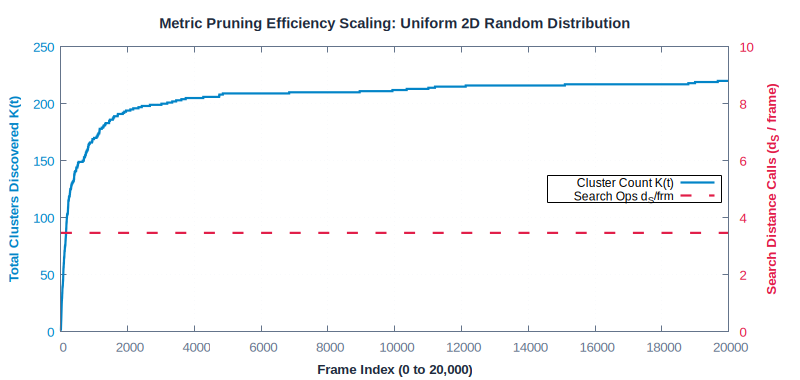

# Uniform 2D Random Distribution

**Category**: 2D Trajectories  
**Data Type**: `txt` (20,000 frames)  
**Clustering Parameter**: `rlim = 0.10`

---

## Scenario Overview

Uniformly distributed random coordinates across a 2D bounding square without low-dimensional
structure or temporal coherence. Tests worst-case spatial coverage scaling.

## Online Stream Clustering Animation

The looping animation below traces online cluster discovery and sample streaming over time:



## Spatial Diagnostics (`gric-plot`)

Below is the visualization generated by `gric-plot` showing the sample manifold,
cluster centroids with radius threshold circles ($r_{\text{lim}}$),
distance call distribution, and cluster size histogram:


### Query & Candidate Ranking Diagnostics


## Voronoi Metric Space Tessellation & Receptive Fields

The Voronoi diagram partitions the 2D feature space into discrete cluster basins overlaid
with the circumscribed radius boundary circles ($r_{\text{lim}}$):



## Candidate Pruning Resolution Breakdown

Stacked area chart illustrating how candidate clusters are resolved on every frame:



## Temporal Dynamics & Cluster Discovery

The timeline below traces active cluster assignments across the 20,000-frame sequence alongside
the cumulative discovery rate ($K(t)$):



## Markov State Transition Matrix ($P(c_t \mid c_{t-1})$)

The transition probability matrix shows the probability flow between states:



## Inter-Cluster Metric Distance Matrix ($D_{CC}$)

Pairwise Euclidean distances between all cluster centroids ($K \times K$):



## Metric Pruning Efficiency Scaling

The chart below demonstrates how candidate distance operations stay flat despite growth in $K$:



## Execution Commands

### 1. Data Generation
```bash
gric-mktxtseq 20000 2Drand.txt 2Drand
```

### 2. Clustering Execution
```bash
gric-cluster 0.10 -maxcl 2500 -maxim 20000 -outdir out_2Drand -clustered 2Drand.txt
```

### 3. Diagnostic Visualization
```bash
gric-plot 2Drand.txt out_2Drand/cluster_run.log docs/benchmarks/images/2Drand.png
```

## Performance Measurements

| Metric | Measured Value | Description |
| :--- | :--- | :--- |
| **Total Frames** | `20,000` | Number of sequential frames processed |
| **Execution Time** | `409.786 ms` | Total wall-clock runtime |
| **Throughput** | `48,805 fps` | Frames processed per second |
| **Active Clusters / States ($K$)** | `220` | Total distinct clusters created |
| **Sample Distances ($d_S$)** | `69,443` | Sample-to-cluster evaluations |
| **Search Calls ($d_S$ / frame)** | **`3.47`** | Search calls per frame |
| **Total Ops ($d$ / frame)** | **`4.68`** | Total distance ops per frame |
| **Pruning Speedup Factor** | **`63.4x`** | Acceleration over exhaustive search |
| **Distance Ops Saved** | **`98.4%`** | Percentage of pairwise calls pruned away |
| **Peak Memory** | `135,000 KB` | Peak resident set size (RSS) |

---

## Algorithmic Insights

As clusters cover the 2D plane uniformly (216 clusters), inter-cluster distance bounds
eliminate distant quadrants, keeping search to **3.51 sample calls per frame** and yielding a
**61.5x pruning factor**.

---

[← Back to Benchmarks Overview](index.md)
