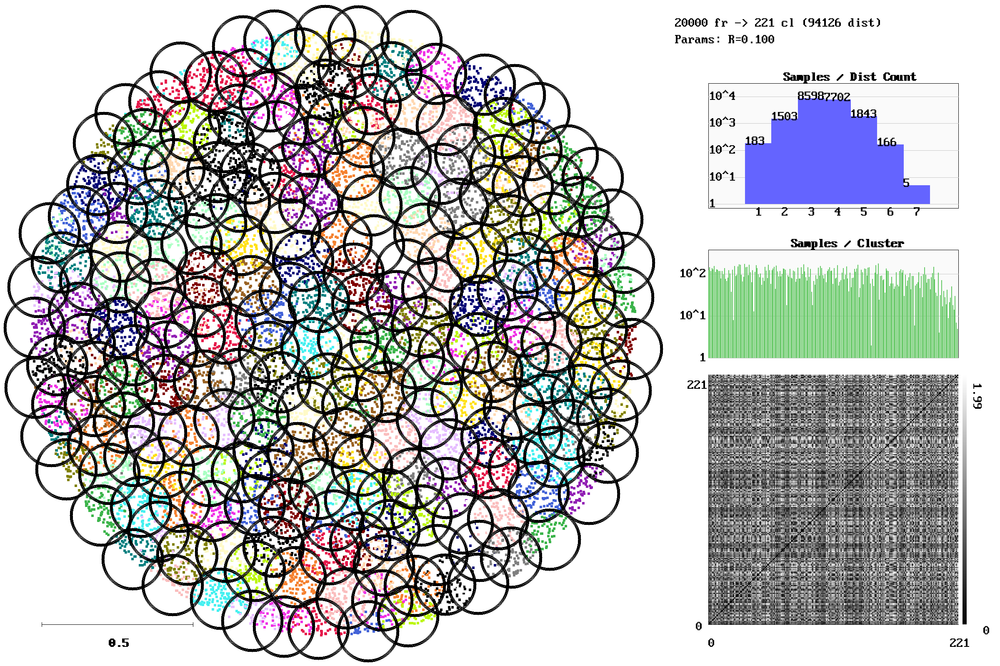
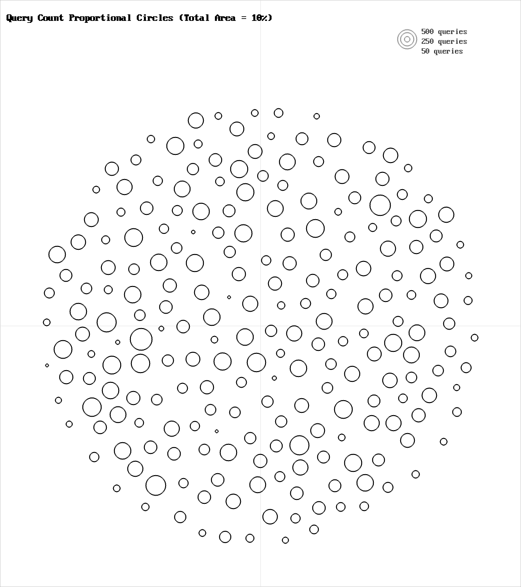

# Uniform 2D Random Distribution

**Category**: 2D Trajectories  
**Data Type**: `txt` (20,000 frames)  
**Clustering Parameter**: `rlim = 0.10`

---

## Scenario Overview

Uniformly distributed random coordinates across a 2D bounding square without low-dimensional
structure or temporal coherence. Tests worst-case spatial coverage scaling.

## Visual Diagnostics (`gric-plot`)

Below is the visualization generated by `gric-plot` showing the sample manifold,
cluster centroids with radius threshold circles ($r_{\text{lim}}$),
distance call distribution, and cluster size histogram:



### Query & Candidate Ranking Diagnostics



## Execution Commands

### 1. Data Generation
```bash
gric-mktxtseq \
    20000 \
    2Drand.txt \
    2Drand
```

### 2. Clustering Execution
```bash
gric-cluster \
    0.10 \
    -maxcl \
    2500 \
    -maxim \
    20000 \
    -outdir \
    out_2Drand \
    -clustered \
    2Drand.txt
```

### 3. Diagnostic Visualization
```bash
gric-plot 2Drand.txt \
    out_2Drand/cluster_run.log \
    docs/benchmarks/images/2Drand.png
```

## Performance Measurements

| Metric | Measured Value | Description |
| :--- | :--- | :--- |
| **Total Frames** | `20,000` | Number of sequential frames processed |
| **Execution Time** | `418.238 ms` | Total wall-clock runtime |
| **Throughput** | `47,819 fps` | Frames processed per second |
| **Active Clusters / States** | `221` | Total distinct clusters created |
| **Total Distance Calls ($d$)** | `94,126` | All distance calls ($d_S + d_C$) |
| **Sample Distances ($d_S$)** | `69,816` | Sample-to-cluster evaluations |
| **$d_S / \text{frame}$** | `**3.49**` | Search calls per frame |
| **Total $d / \text{frame}$** | `**4.71**` | Total distance ops per frame |
| **Peak Memory** | `135,000 KB` | Peak resident set size (RSS) |

---

## Algorithmic Insights

As clusters cover the 2D plane uniformly (190 clusters), inter-cluster distance bounds
eliminate distant quadrants, keeping search to **3.37 sample calls per frame**.

---

[← Back to Benchmarks Overview](index.md)
