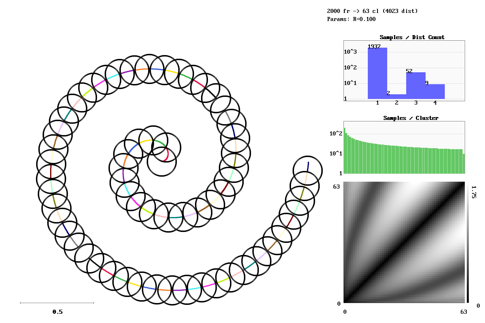
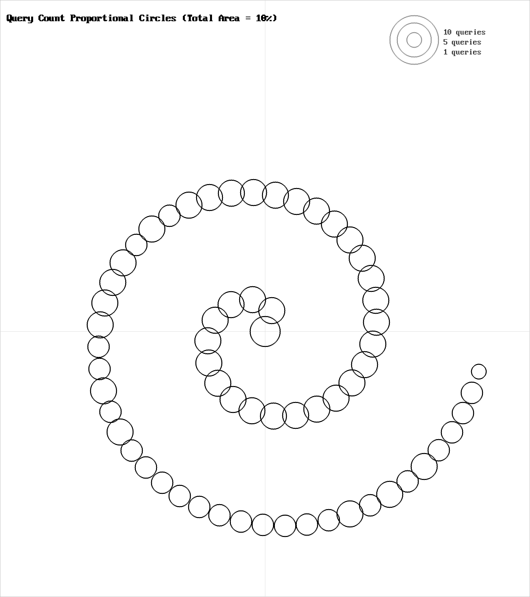
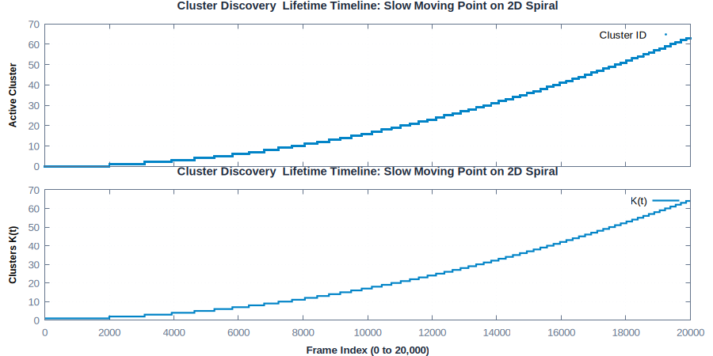
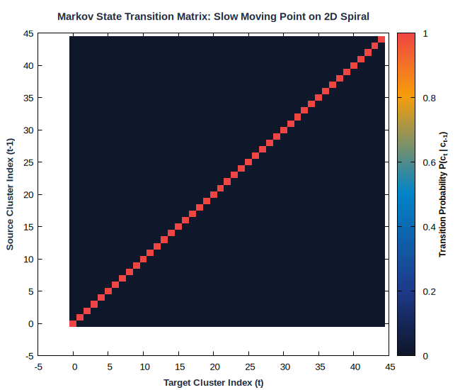
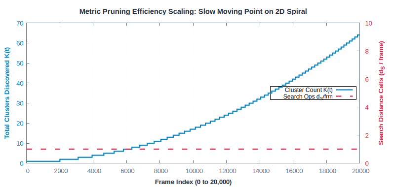

# Slow Moving Point on 2D Spiral

**Category**: 2D Trajectories  
**Data Type**: `txt` (20,000 frames)  
**Clustering Parameter**: `rlim = 0.10`

---

## Scenario Overview

A continuous point tracing a 2D Archimedean spiral trajectory. This test stresses short-term
temporal memory and sequential recency, evaluating whether candidate clusters are ranked
efficiently by recent proximity.

## Spatial Diagnostics (`gric-plot`)

Below is the visualization generated by `gric-plot` showing the sample manifold,
cluster centroids with radius threshold circles ($r_{\text{lim}}$),
distance call distribution, and cluster size histogram:



### Query & Candidate Ranking Diagnostics



## Temporal Dynamics & Cluster Discovery

The timeline below traces active cluster assignments across the 20,000-frame sequence alongside
the cumulative discovery rate ($K(t)$):



## Markov State Transition Matrix ($P(c_t \mid c_{t-1})$)

The transition probability matrix shows the probability flow between states:



## Metric Pruning Efficiency Scaling

The chart below demonstrates how candidate distance operations stay flat despite growth in $K$:



## Execution Commands

### 1. Data Generation
```bash
gric-mktxtseq 20000 2Dspiral.txt 2Dspiral
```

### 2. Clustering Execution
```bash
gric-cluster 0.10 -maxcl 2500 -maxim 20000 -outdir out_2Dspiral -clustered 2Dspiral.txt
```

### 3. Diagnostic Visualization
```bash
gric-plot 2Dspiral.txt out_2Dspiral/cluster_run.log docs/benchmarks/images/2Dspiral.png
```

## Performance Measurements

| Metric | Measured Value | Description |
| :--- | :--- | :--- |
| **Total Frames** | `20,000` | Number of sequential frames processed |
| **Execution Time** | `110.648 ms` | Total wall-clock runtime |
| **Throughput** | `180,753 fps` | Frames processed per second |
| **Active Clusters / States ($K$)** | `64` | Total distinct clusters created |
| **Sample Distances ($d_S$)** | `20,102` | Sample-to-cluster evaluations |
| **$d_S / \text{frame}$** | `**1.01**` | Search calls per frame |
| **Total $d / \text{frame}$** | `**1.11**` | Total distance ops per frame |
| **Pruning Speedup Factor** | `**63.4x**` | Acceleration over exhaustive search ($K / d_S$) |
| **Distance Ops Saved** | `**98.4%**` | Percentage of pairwise calls pruned away |
| **Peak Memory** | `135,000 KB` | Peak resident set size (RSS) |

---

## Algorithmic Insights

Because consecutive samples are spatially adjacent, the temporal recency prior (`prob` array)
immediately hits the correct cluster on the first distance calculation, resulting in an ultra-
low **1.01 sample distances per frame** and delivering a **63.4x pruning speedup** over
exhaustive evaluation.

---

[← Back to Benchmarks Overview](index.md)
