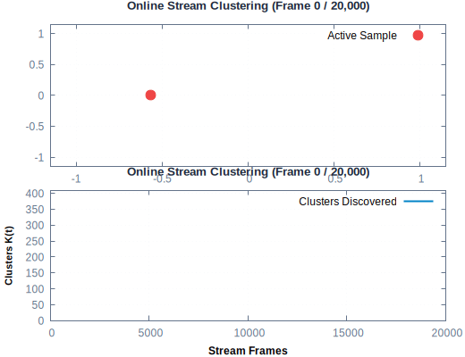
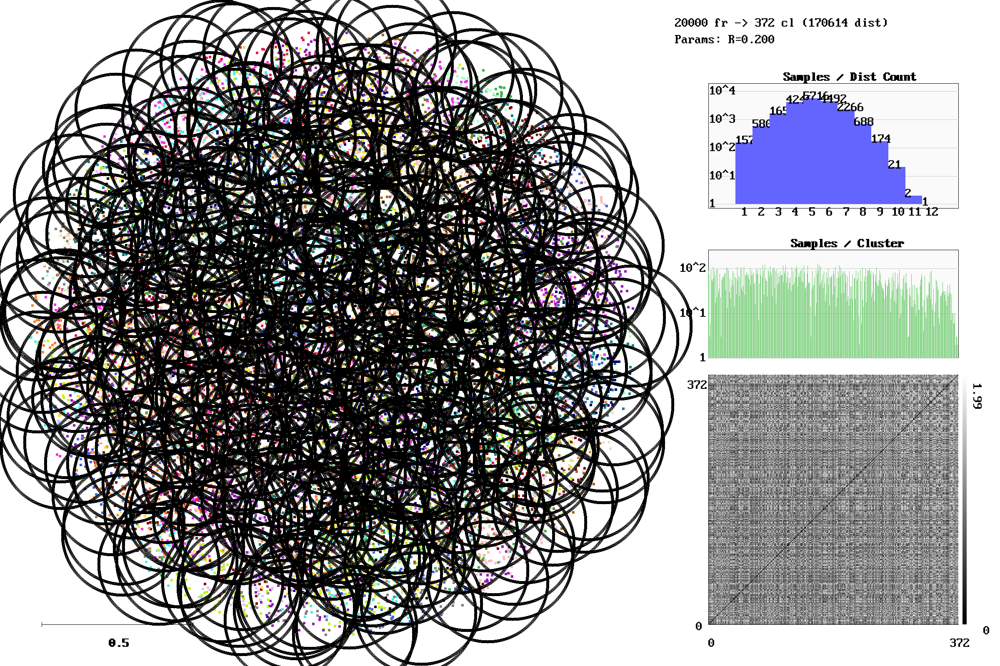
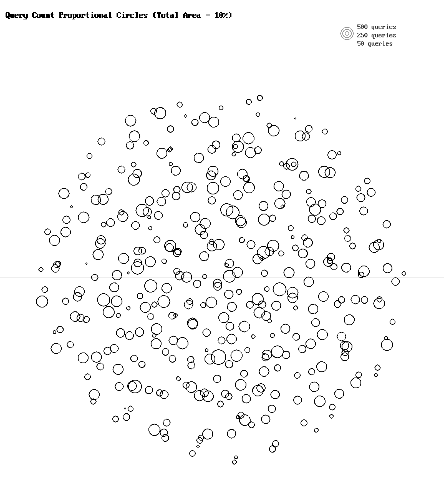
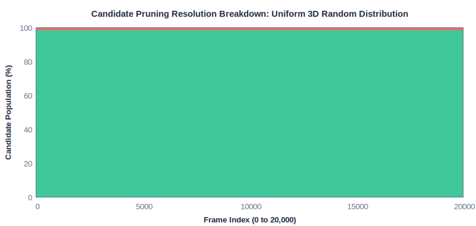
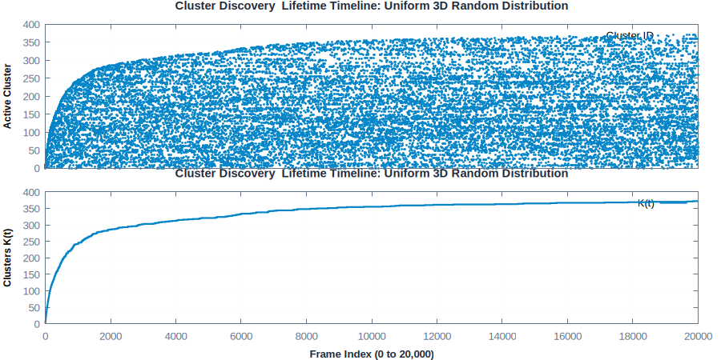
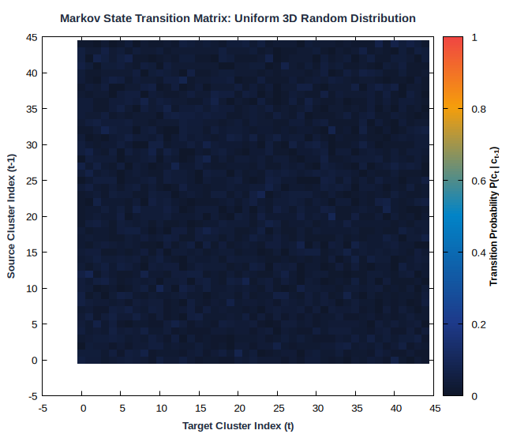
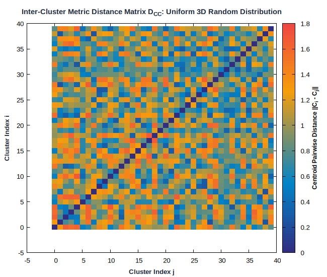
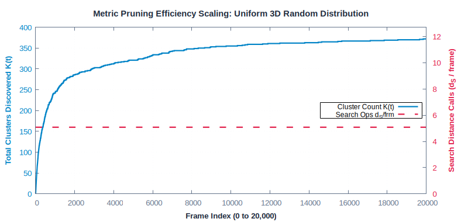

# Uniform 3D Random Distribution

**Category**: 3D Manifolds  
**Data Type**: `txt` (20,000 frames)  
**Clustering Parameter**: `rlim = 0.20`

---

## Scenario Overview

Uniform 3D volume filling. Evaluates 3D metric packing and upper/lower bound pruning across
370+ clusters.

## Online Stream Clustering Animation

The looping animation below traces online cluster discovery and sample streaming over time:



## Spatial Diagnostics (`gric-plot`)

Below is the visualization generated by `gric-plot` showing the sample manifold,
cluster centroids with radius threshold circles ($r_{\text{lim}}$),
distance call distribution, and cluster size histogram:



### Query & Candidate Ranking Diagnostics



## Candidate Pruning Resolution Breakdown

Stacked area chart illustrating how candidate clusters are resolved on every frame:



## Temporal Dynamics & Cluster Discovery

The timeline below traces active cluster assignments across the 20,000-frame sequence alongside
the cumulative discovery rate ($K(t)$):



## Markov State Transition Matrix ($P(c_t \mid c_{t-1})$)

The transition probability matrix shows the probability flow between states:



## Inter-Cluster Metric Distance Matrix ($D_{CC}$)

Pairwise Euclidean distances between all cluster centroids ($K \times K$):



## Metric Pruning Efficiency Scaling

The chart below demonstrates how candidate distance operations stay flat despite growth in $K$:



## Execution Commands

### 1. Data Generation
```bash
gric-mktxtseq 20000 3Drand.txt 3Drand
```

### 2. Clustering Execution
```bash
gric-cluster 0.20 -maxcl 2500 -maxim 20000 -outdir out_3Drand -clustered 3Drand.txt
```

### 3. Diagnostic Visualization
```bash
gric-plot 3Drand.txt out_3Drand/cluster_run.log docs/benchmarks/images/3Drand.png
```

## Performance Measurements

| Metric | Measured Value | Description |
| :--- | :--- | :--- |
| **Total Frames** | `20,000` | Number of sequential frames processed |
| **Execution Time** | `4257.586 ms` | Total wall-clock runtime |
| **Throughput** | `4,697 fps` | Frames processed per second |
| **Active Clusters / States ($K$)** | `372` | Total distinct clusters created |
| **Sample Distances ($d_S$)** | `101,608` | Sample-to-cluster evaluations |
| **Search Calls ($d_S$ / frame)** | **`5.08`** | Search calls per frame |
| **Total Ops ($d$ / frame)** | **`8.53`** | Total distance ops per frame |
| **Pruning Speedup Factor** | **`73.2x`** | Acceleration over exhaustive search |
| **Distance Ops Saved** | **`98.6%`** | Percentage of pairwise calls pruned away |
| **Peak Memory** | `135,000 KB` | Peak resident set size (RSS) |

---

## Algorithmic Insights

Triangle inequality pruning scales robustly to 3D volume, requiring **5.11 sample calls per
frame** out of 371 active clusters (a **72.6x speedup**).

---

[← Back to Benchmarks Overview](index.md)
