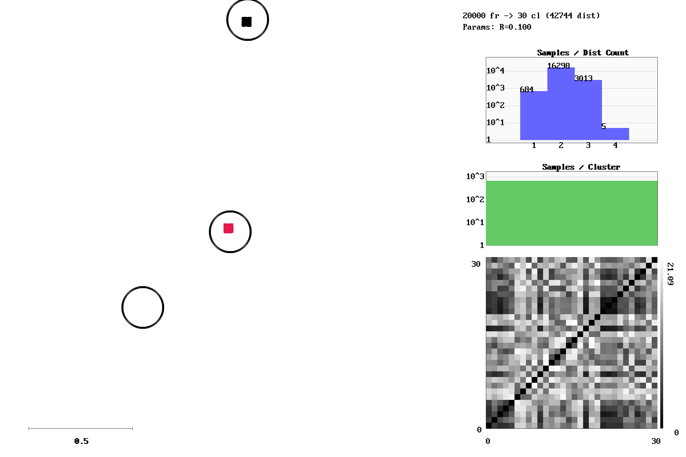

# 3D Star Trajectory with Noise

**Category**: 3D Manifolds  
**Data Type**: `txt` (20,000 frames)  
**Clustering Parameter**: `rlim = 0.10`

---

## Scenario Overview

Multi-arm 3D star topology with 30 distinct spatial nodes and additive noise. Tests discrete
cluster separation in 3D space.

## Visual Diagnostics (`gric-plot`)

Below is the visualization generated by `gric-plot` showing the sample manifold,
cluster centroids with radius threshold circles ($r_{\text{lim}}$),
distance call distribution, and cluster size histogram:



### Query & Candidate Ranking Diagnostics


## Execution Commands

### 1. Data Generation
```bash
gric-mktxtseq 20000 3Dstar.txt 3Dstar30 -noise 0.02 -shuffle
```

### 2. Clustering Execution
```bash
gric-cluster 0.10 -maxcl 2500 -maxim 20000 -outdir out_3Dstar -clustered 3Dstar.txt
```

### 3. Diagnostic Visualization
```bash
gric-plot 3Dstar.txt out_3Dstar/cluster_run.log docs/benchmarks/images/3Dstar.png
```

## Performance Measurements

| Metric | Measured Value | Description |
| :--- | :--- | :--- |
| **Total Frames** | `20,000` | Number of sequential frames processed |
| **Execution Time** | `147.219 ms` | Total wall-clock runtime |
| **Throughput** | `135,852 fps` | Frames processed per second |
| **Active Clusters / States** | `30` | Total distinct clusters created |
| **Total Distance Calls ($d$)** | `42,744` | All distance calls ($d_S + d_C$) |
| **Sample Distances ($d_S$)** | `42,309` | Sample-to-cluster evaluations |
| **$d_S / \text{frame}$** | `**2.12**` | Search calls per frame |
| **Total $d / \text{frame}$** | `**2.14**` | Total distance ops per frame |
| **Peak Memory** | `135,000 KB` | Peak resident set size (RSS) |

---

## Algorithmic Insights

All 30 star vertices are discovered cleanly and pruned efficiently during lookup (**2.10 sample
calls per frame**).

---

[← Back to Benchmarks Overview](index.md)
