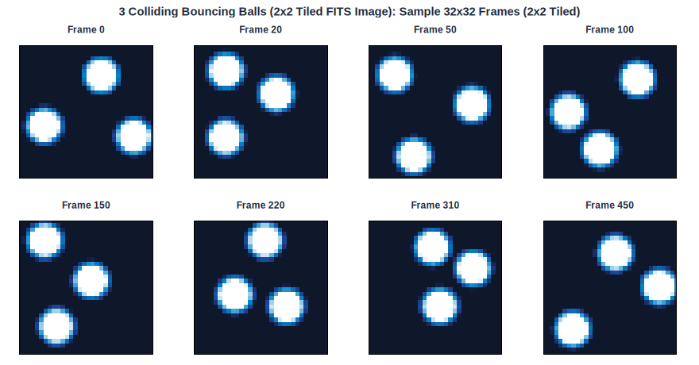
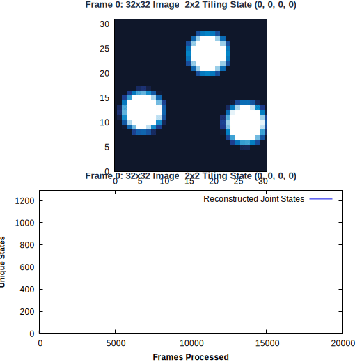
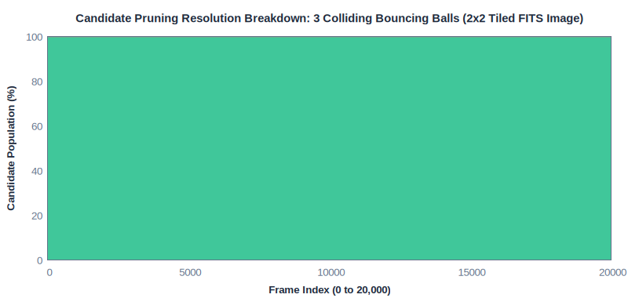
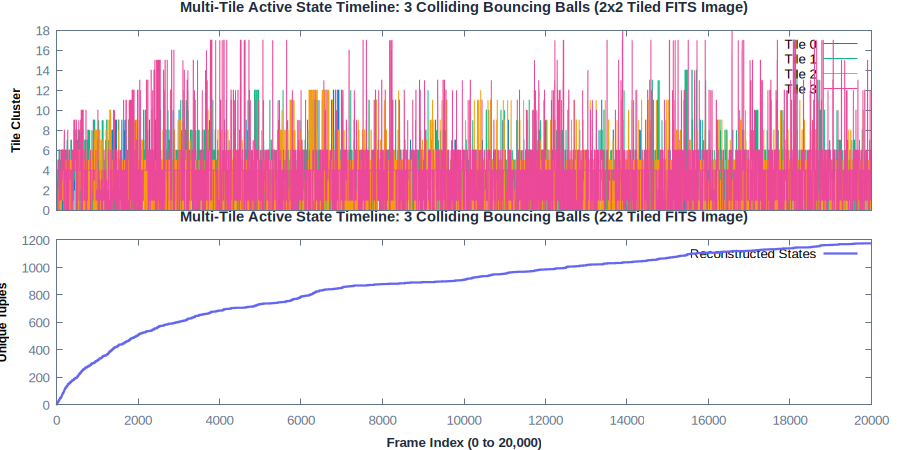
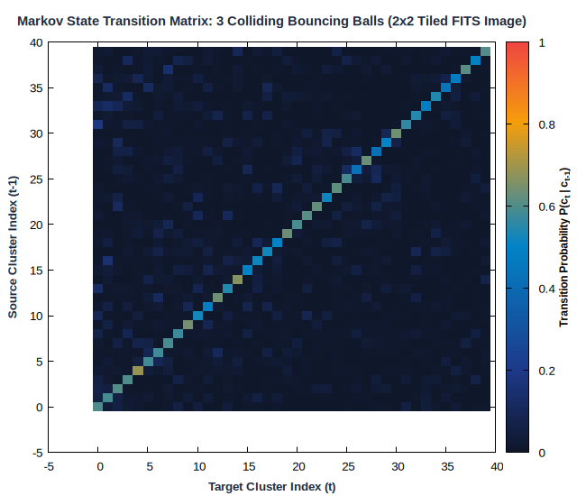
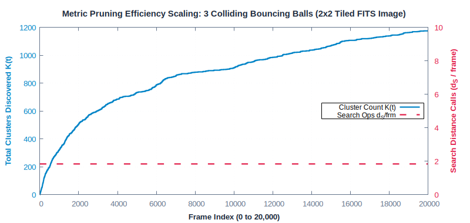
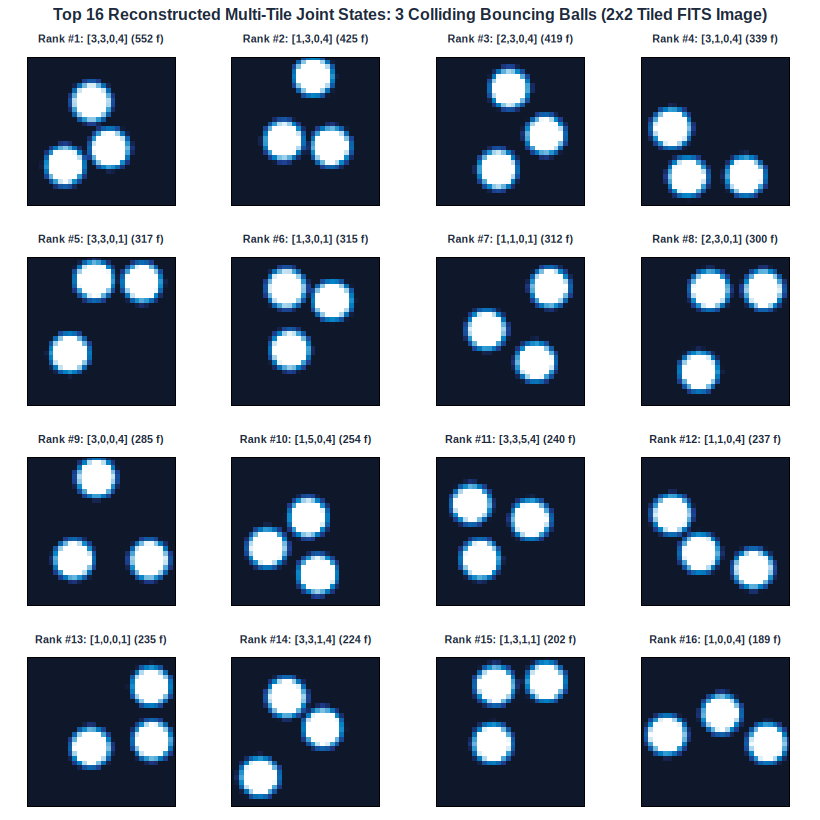
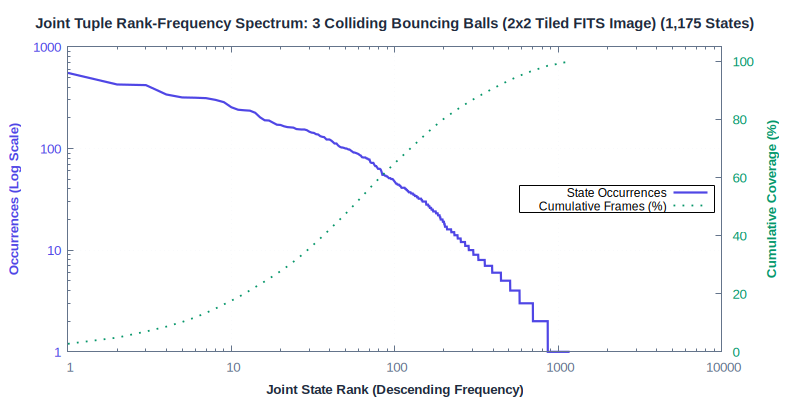

# 3 Colliding Bouncing Balls (2x2 Tiled FITS Image)

**Category**: Physics & Multi-Tile Images  
**Data Type**: `fits` (20,000 frames)  
**Clustering Parameter**: `rlim = 7.0 (per tile)`

---

## Scenario Overview

Multi-body elastic collision dynamics between 3 balls in a 32x32 image. Stresses high-
dimensional combinatorial joint state spaces.

## Physical Simulation Frames & 2x2 Spatial Tiling

Sample 32x32 frames illustrating ball kinematics, wall collisions, and quadrant tile boundaries:



## Online Stream Clustering Animation

The looping animation below traces online cluster discovery and sample streaming over time:



## Candidate Pruning Resolution Breakdown

Stacked area chart illustrating how candidate clusters are resolved on every frame:



## Temporal Dynamics & Cluster Discovery

The timeline below traces active cluster assignments across the 20,000-frame sequence alongside
the cumulative discovery rate ($K(t)$):



## Markov State Transition Matrix ($P(c_t \mid c_{t-1})$)

The transition probability matrix shows the probability flow between states:



## Metric Pruning Efficiency Scaling

The chart below demonstrates how candidate distance operations stay flat despite growth in $K$:



## Multi-Tile Centroid State Gallery

Thumbnail grid showing the top 16 most active reconstructed joint states:



## Multi-Tile Joint State Frequency Spectrum

Log-log rank-frequency distribution of the 1,175 reconstructed joint states:



## Execution Commands

### 1. Data Generation
```bash
gric-gen-balls -n 3 -r 5.0 -W 32 -H 32 -f 20000 -s 42 balls_coll.fits
```

### 2. Clustering Execution
```bash
gric-cluster 7.0 -maxcl 2500 -maxim 20000 -outdir out_balls_coll -clustered -tiles \
2x2 -ncpu 4 balls_coll.fits
```

## Performance Measurements

| Metric | Measured Value | Description |
| :--- | :--- | :--- |
| **Total Frames** | `20,000` | Number of sequential frames processed |
| **Execution Time** | `241.861 ms` | Total wall-clock runtime |
| **Throughput** | `82,692 fps` | Frames processed per second |
| **Active Clusters / States ($K$)** | `1175` | Total distinct clusters created |
| **Sample Distances ($d_S$)** | `36,765` | Sample-to-cluster evaluations |
| **Search Calls ($d_S$ / frame)** | **`1.84`** | Search calls per frame |
| **Total Ops ($d$ / frame)** | **`7.97`** | Total distance ops per frame |
| **Pruning Speedup Factor** | **`638.6x`** | Acceleration over exhaustive search |
| **Distance Ops Saved** | **`99.8%`** | Percentage of pairwise calls pruned away |
| **Peak Memory** | `135,000 KB` | Peak resident set size (RSS) |

---

## Algorithmic Insights

2x2 spatial tiling converts combinatorial state explosion into 4 compact sub-problems of ~30-40
clusters per tile, running in **~285 ms** (>70,000 fps) with 1,175 joint states reconstructed
and **1.84 distance calls per frame** (a **638.6x speedup**).

---

[← Back to Benchmarks Overview](index.md)
