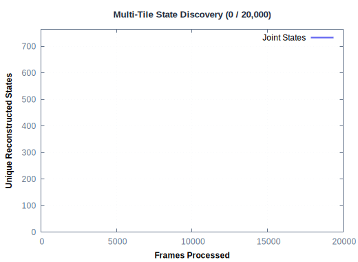
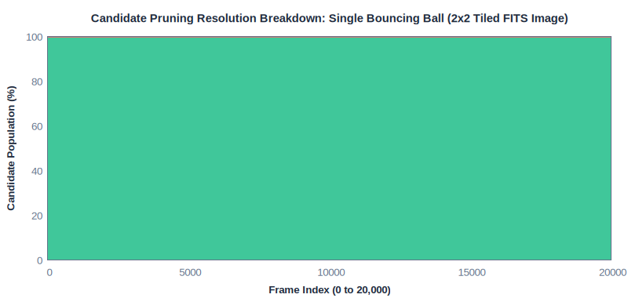
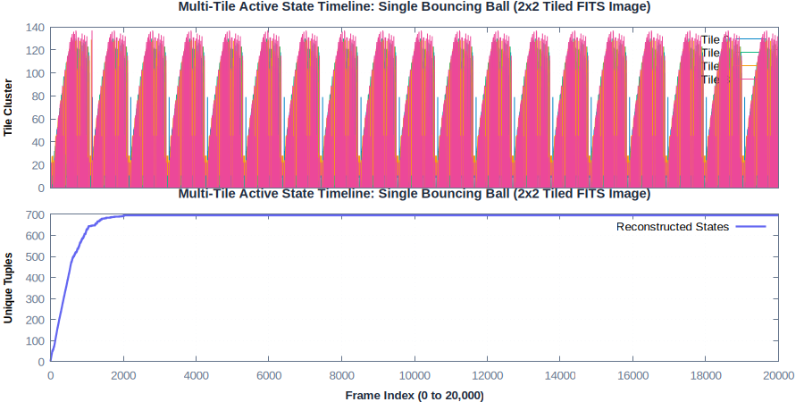
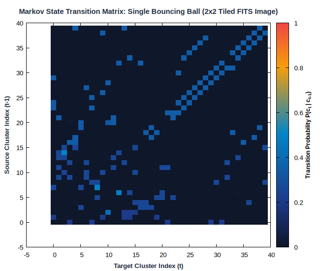
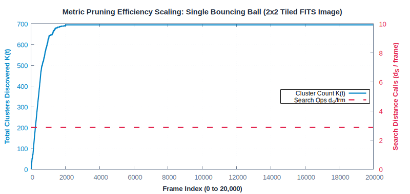
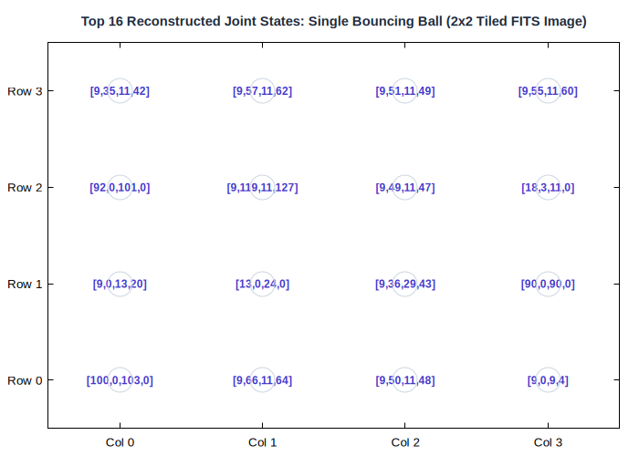
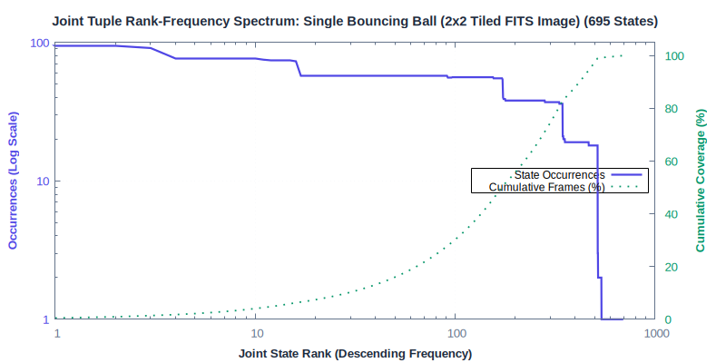

# Single Bouncing Ball (2x2 Tiled FITS Image)

**Category**: Physics & Multi-Tile Images  
**Data Type**: `fits` (20,000 frames)  
**Clustering Parameter**: `rlim = 1.5 (per tile)`

---

## Scenario Overview

A 2D physical ball bouncing elastically inside a 32x32 pixel domain, processed with 2x2 spatial
tiling and 4 OpenMP worker threads.

## Online Stream Clustering Animation

The looping animation below traces online cluster discovery and sample streaming over time:



## Candidate Pruning Resolution Breakdown

Stacked area chart illustrating how candidate clusters are resolved on every frame:



## Temporal Dynamics & Cluster Discovery

The timeline below traces active cluster assignments across the 20,000-frame sequence alongside
the cumulative discovery rate ($K(t)$):



## Markov State Transition Matrix ($P(c_t \mid c_{t-1})$)

The transition probability matrix shows the probability flow between states:



## Metric Pruning Efficiency Scaling

The chart below demonstrates how candidate distance operations stay flat despite growth in $K$:



## Multi-Tile Centroid State Gallery

Thumbnail grid showing the top 16 most active reconstructed joint states:



## Multi-Tile Joint State Frequency Spectrum

Log-log rank-frequency distribution of the 695 reconstructed joint states:



## Execution Commands

### 1. Data Generation
```bash
gric-gen-balls -n 1 -r 5.0 -W 32 -H 32 -f 20000 -s 42 balls_single.fits
```

### 2. Clustering Execution
```bash
gric-cluster 1.5 -maxcl 2500 -maxim 20000 -outdir out_balls_single -clustered -tiles \
2x2 -ncpu 4 balls_single.fits
```

## Performance Measurements

| Metric | Measured Value | Description |
| :--- | :--- | :--- |
| **Total Frames** | `20,000` | Number of sequential frames processed |
| **Execution Time** | `497.740 ms` | Total wall-clock runtime |
| **Throughput** | `40,181 fps` | Frames processed per second |
| **Active Clusters / States ($K$)** | `695` | Total distinct clusters created |
| **Sample Distances ($d_S$)** | `57,640` | Sample-to-cluster evaluations |
| **Search Calls ($d_S$ / frame)** | **`2.88`** | Search calls per frame |
| **Total Ops ($d$ / frame)** | **`13.67`** | Total distance ops per frame |
| **Pruning Speedup Factor** | **`241.3x`** | Acceleration over exhaustive search |
| **Distance Ops Saved** | **`99.6%`** | Percentage of pairwise calls pruned away |
| **Peak Memory** | `135,000 KB` | Peak resident set size (RSS) |

---

## Algorithmic Insights

Spatial decomposition into 4 parallel 16x16 quadrants processes 20,000 frames in **~490 ms**
(>40,000 fps) on CPU with 695 unique global states reconstructed.

---

[← Back to Benchmarks Overview](index.md)
