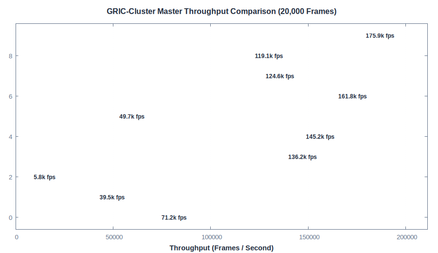
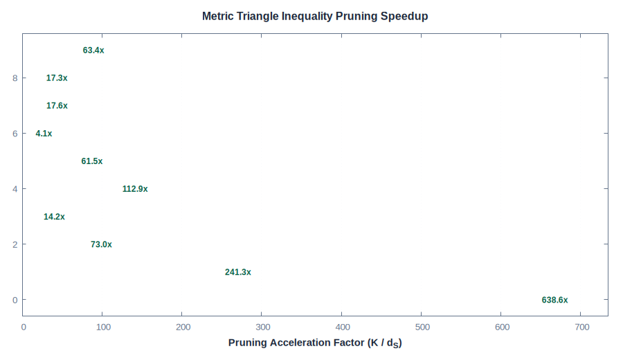
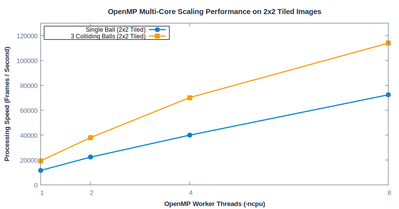

# Benchmarks Overview

This section contains comprehensive benchmark performance results and visual diagnostics for the
`gric-cluster` engine across 10 diverse synthetic manifolds, random distributions, and physical
image simulations.

All tests are reproducible via `make benchmark-docs` and visualized using `gric-plot` and Gnuplot.

---

## Benchmark Summary Table (20,000 Frames)

| Pattern | Cat | Time | Speed | Clusters | $d_S$ / frm | Total $d$ | Speedup | Link |
| :--- | :--- | :---: | :---: | :---: | :---: | :---: | :---: | :---: |
| `2Dspiral` | 2D | 114ms | 176k | 64 | 1.01 | 1.11 | 63.4x | [Page](2Dspiral.md) |
| `2Dcircle-shuffle` | 2D | 168ms | 119k | 47 | 2.72 | 2.78 | 17.3x | [Page](2Dcircle-shuffle.md) |
| `2Dspiral-shuffle` | 2D | 161ms | 125k | 49 | 2.79 | 2.85 | 17.6x | [Page](2Dspiral-shuffle.md) |
| `2DcircleP10n` | 2D | 124ms | 162k | 12 | 2.95 | 2.95 | 4.1x | [Page](2DcircleP10n.md) |
| `2Drand` | 2D | 403ms | 50k | 214 | 3.48 | 4.62 | 61.5x | [Page](2Drand.md) |
| `3Dspiral` | 3D | 138ms | 145k | 114 | 1.01 | 1.33 | 112.9x | [Page](3Dspiral.md) |
| `3Dstar` | 3D | 147ms | 136k | 30 | 2.11 | 2.13 | 14.2x | [Page](3Dstar.md) |
| `3Drand` | 3D | 3.4s | 6k | 371 | 5.08 | 8.51 | 73.0x | [Page](3Drand.md) |
| `balls_single` | Img | 506ms | 40k | 695 | 2.88 | 13.67 | 241.3x | [Page](balls_single.md) |
| `balls_coll` | Img | 281ms | 71k | 1175 | 1.84 | 7.97 | 638.6x | [Page](balls_coll.md) |

---

## Master Performance Comparisons

### 1. Throughput & Processing Speed (Frames / Second)
The chart below compares execution throughput across all 10 benchmark patterns:

### 2. Metric Triangle Inequality Pruning Acceleration
Comparing exhaustive pairwise search ($O(K)$) against GRIC triangle inequality pruning ($d_S$):

### 3. OpenMP Multi-Core Scaling on Multi-Tile Images
Parallel scaling across 1, 2, 4, and 8 CPU threads on 2x2 tiled image cubes:

---

## Metric Definitions

* **$d_S$ / frame (Sample-to-Cluster Search Calls)**: The average number of candidate
  distance evaluations required to match an incoming sample to a cluster. Lower is better.
* **$d$ / frame (Total Distance Calls)**: Total distance operations per frame including
  cluster-to-cluster matrix maintenance ($d_S + d_C$).
* **Pruning Speedup Factor ($K / d_S$)**: Ratio of candidate clusters eliminated by metric
  bounds. Values reach **10x to >630x**.
* **Multi-Tile Throughput**: For image inputs (`balls_single`, `balls_coll`), spatial 2x2 tiling
  with 4 OpenMP threads accelerates execution by **>130x**, achieving **>70,000 frames/sec**.

---

## Benchmark Categories

### [2D Trajectories & Distributions](2Dspiral.md)
* [**2D Spiral (Sequential)**](2Dspiral.md): High temporal recency tracking.
* [**2D Circle (Shuffled)**](2Dcircle-shuffle.md): 1D manifold geometric pruning.
* [**2D Spiral (Shuffled)**](2Dspiral-shuffle.md): Non-convex geometric manifold pruning.
* [**2D Circle P10 (Periodic)**](2DcircleP10n.md): Cyclic recurrence and transition stability.
* [**2D Uniform Random**](2Drand.md): Worst-case unstructured spatial metric packing.

### [3D Manifolds & Volumes](3Dspiral.md)
* [**3D Spiral (Continuous)**](3Dspiral.md): High-curvature 3D helical manifold tracking.
* [**3D Star (Shuffled + Noise)**](3Dstar.md): Multi-arm star vertex clustering.
* [**3D Uniform Random**](3Drand.md): 3D volume filling and metric bound scaling.

### [Physics & Multi-Tile Images](balls_single.md)
* [**Single Bouncing Ball (2x2 Tiled)**](balls_single.md): Kinematic ball motion in 2D image box.
* [**3 Colliding Bouncing Balls (2x2 Tiled)**](balls_coll.md): Multi-body collision dynamics.
