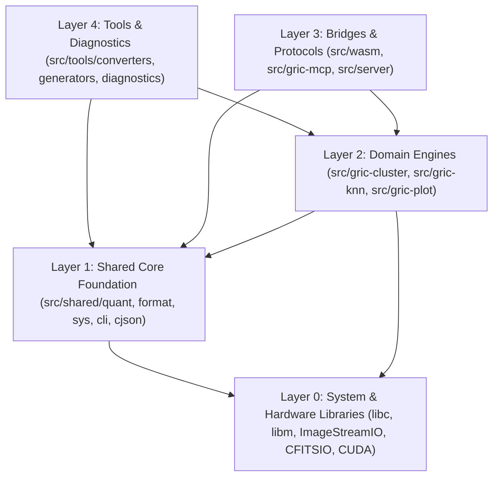

# Codebase Architecture & Modularity

The **GRIC** software ecosystem is engineered as a high-performance modular C17 library
and application suite designed for ultra-low-latency real-time telemetry processing,
astronomical wavefront clustering, and high-dimensional vector search.

---

## Architectural Principles

1. **Layered Separation of Concerns**: High-level tools and bridges depend on domain engines,
   which depend on shared foundational libraries, which depend on system primitives.
   Dependencies flow strictly downward. Circular dependencies are strictly forbidden.
2. **Minimal Cross-Module Coupling**: Avoid introducing deep internal dependencies across
   subsystems (e.g. plugins depending on private internal headers of another engine).
   Subsystems communicate exclusively through clean public interfaces.
3. **Zero-Allocation Inner Compute Loops**: Inner clustering loops (`run_clustering`,
   `cluster_frame`) and vector search routines (`knn_run_search`) pre-allocate all working
   heaps, scratch buffers, and candidate pools during configuration.
4. **Header Encapsulation**: Every `.c` file strictly includes only the specific headers it
   requires. Header side-effects are eliminated.

---

## Layered Architecture Model

The codebase is organized into five architectural layers:

---

## Source Directory Layout

The physical directory tree under `src/` directly mirrors these architectural layers:

| Directory | Layer | Purpose & Responsibility |
| :--- | :---: | :--- |
| **`src/shared/quant/`** | 1 | Quantization engines (SQ8/SQ16, EQ16, RaBitQ, PQ). |
| **`src/shared/format/`** | 1 | Serialization, ASCII parsers, coordinate converters. |
| **`src/shared/sys/`** | 1 | Low-level OS primitives, timing, telemetry timers. |
| **`src/shared/cli/`** | 1 | Shared CLI parsing, help viewers, terminal styles. |
| **`src/shared/cjson/`** | 1 | Embedded JSON parser for MCP and configuration. |
| **`src/gric-cluster/core/`** | 2 | Primary clustering engine (`cluster_core`, `step`). |
| **`src/gric-cluster/math/`** | 2 | Distance routines, GEMM engines, SIMD microkernels. |
| **`src/gric-cluster/io/`** | 2 | Ingestion, FITS/PNG writer, ASCII writers, storage. |
| **`src/gric-cluster/multitile/`** | 2 | Axis decomposition, tile scattering, Pass 2 fusion. |
| **`src/gric-cluster/steps/`** | 2 | Step modules (candidates, DCC, priors, prediction). |
| **`src/gric-cluster/viz/`** | 2 | Real-time terminal telemetry and progress displays. |
| **`src/gric-cluster/cli/`** | 2 | Top-level CLI configuration loader and entry point. |
| **`src/gric-knn/core/`** | 2 | KNN search engine, model loading, query batching. |
| **`src/gric-knn/search/`** | 2 | Exact and metric-pruned nearest neighbor search. |
| **`src/gric-knn/pruning/`** | 2 | Triangle inequality and geometric pruning tests. |
| **`src/gric-knn/cache/`** | 2 | DCC cache lookups, Sparse DCC, LRU block buffers. |
| **`src/gric-knn/cross/`** | 2 | Cross-dataset indexing and pairing validation. |
| **`src/gric-knn/io/`** | 2 | Model readers, query streaming, neighbor writers. |
| **`src/gric-knn/cli/`** | 2 | CLI parsing for `gric-knn` and `gric-knn-avg`. |
| **`src/gric-knn/gpu/`** | 2 | CUDA distance kernels, IVF clustering, GPU search. |
| **`src/gric-plot/canvas/`** | 2 | Drawing primitives, fonts, palettes, framebuffers. |
| **`src/gric-plot/render/`** | 2 | Projection renderers, 2D/3D plots, PNG output. |
| **`src/gric-plot/cli/`** | 2 | CLI interface for high-resolution scatter plotting. |
| **`src/wasm/`** | 3 | WebAssembly bridge APIs for browser simulator. |
| **`src/gric-mcp/`** | 3 | Model Context Protocol server exposing tool APIs. |
| **`src/server/`** | 3 | Embedded HTTP server for monitoring and GUI. |
| **`src/tools/converters/`** | 4 | File converters (`gric-ascii2bin`, etc.). |
| **`src/tools/generators/`** | 4 | Synthetic data generators (`gric-gen-balls`, etc.). |
| **`src/tools/diagnostics/`** | 4 | Diagnostics (`gric-status`, `gric-probe`, etc.). |
| **`src/tools/media/`** | 4 | Visualization converters (`ascii-spot-2-video`). |

---

## Dependency Invariant Rules

1. **Modules in `src/shared/` must never include headers from domain engines**.
   Shared utilities represent foundational dependencies.
2. **`gric-knn` depends on `gric-cluster` core types only via public headers**.
   Internal clustering state mutations remain encapsulated within `cluster_core.h`.
3. **Tools in `src/tools/` interact only through public APIs**.
   Utility binaries link against the library targets produced by CMake and do not include
   private step headers.
4. **WASM bridges isolate web-specific memory allocations**.
   WebAssembly handles (`WasmHandle`, `WasmMultiTileHandle`) wrap core state instances
   and manage boundary data conversions without modifying native C algorithm code.
