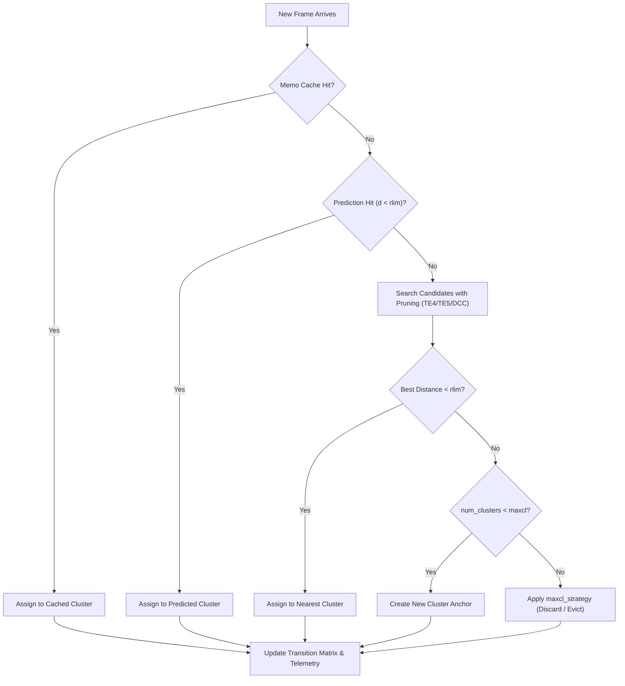

# Clustering & KNN Engine Internals

This document details the internal data structures, state machines, and execution pipelines of
the **GRIC** clustering engine (`src/gric-cluster/`) and vector search solver (`src/gric-knn/`).

---

## 1. Core Data Structures

### `Frame`
Represents an individual multidimensional sample or cluster anchor in memory:

```c
typedef struct {
    uint64_t width;      /* Dimensionality along axis 0 (elements) */
    uint64_t height;     /* Axis 1 dimension (usually 1 for vectors) */
    uint64_t id;         /* Zero-based sequential frame sequence ID */
    uint64_t cnt0;       /* Real-time hardware stream sequence counter */
    int      is_double;  /* 1 = double precision, 0 = single precision */
    void    *data;       /* Pointer to contiguous coordinate array */
} Frame;
```

### `Cluster`
Represents a discovered cluster centroid and associated statistics:

```c
typedef struct {
    Frame        anchor;  /* Centroid frame coordinates in feature space */
    double       prob;    /* Prior probability of membership */
    int          id;      /* Unique identifier assigned at creation */
} Cluster;
```

### `ClusterState`
Holds the entire active clustering session state:

```c
typedef struct {
    int               num_clusters;       /* Count of active clusters */
    Cluster          *clusters;           /* Array of cluster anchors [maxnbclust] */
    VisitorList      *cluster_visitors;   /* Per-cluster member frame lists */
    int              *assignments;        /* Per-frame cluster IDs [maxnbfr] */
    long             *transition_matrix;  /* Markov transition counts [N * N] */
    ClusterScratch    scratch;            /* Reusable scratch buffers and DCC bounds */
    ClusterTelemetry  telemetry;          /* Real-time pruning and distance metrics */
    TraceBuffer      *trace;              /* Optional circular trace ring buffer */
} ClusterState;
```

---

## 2. Ingestion & Search Pipeline (Pass 1)

For every incoming frame, `cluster_frame()` executes a 4-stage decision pipeline:



### 1. Memoization Lookup
If identical consecutive frames or cyclic trajectories occur, the memo cache provides an
immediate $O(1)$ short-circuit assignment without distance computations.

### 2. Temporal Markov Prediction
When temporal prediction (`pred_mode`) is enabled, transition history predicts the most
likely cluster candidate. If the Euclidean distance to the predicted anchor is $< r_{\text{lim}}$,
evaluation terminates immediately ($O(1)$ search).

### 3. Metric-Pruned Candidate Search
If prediction misses, candidate clusters are evaluated in order of likelihood.
Pruning filters eliminate distance calls using metric lower bounds:
* **TE4 (4-Point Bound)**: Uses distance to previous sample frame $x_{t-1}$.
* **TE5 (5-Point Bound)**: Uses distance to two previous frame states $x_{t-1}$ and $x_{t-2}$.
* **DCC Bounds**: Pairwise cluster-to-cluster distance bounds eliminate candidates too distant
  to qualify.

### 4. Assignment or Anchor Creation
If a qualifying cluster satisfies $d(x, c_k) \le r_{\text{lim}}$, the frame is assigned to the
nearest centroid. Otherwise, a new cluster anchor is created and DCC bounds are populated.

---

## 3. Pass 2 Nearest Reassignment & Fusion

Online clustering inevitably assigns earlier frames before later clusters exist. GRIC provides
two refinement mechanisms:

* **Pass 2 Nearest Reassignment (`pass2_reassign`)**: Re-evaluates all frames against the final
  complete set of anchors, moving frames to closer anchors discovered later in the session.
* **Multi-Tile Bayesian Fusion (`pass2_fuse`)**: In multi-tile axis decomposition, independent
  1D tile assignments are fused using a joint occurrence contingency table (CPT) to refine
  global assignments.

---

## 4. Algorithmic Invariants

All engine components guarantee and enforce the following mathematical invariants:

1. **Metric Space Triangle Inequality**:
   For any sample $x$ and anchors $c_i, c_j$:
   $$|d(x, c_i) - d(c_i, c_j)| \le d(x, c_j) \le d(x, c_i) + d(c_i, c_j)$$
2. **Strict Capacity Bounds**:
   The active cluster count satisfies $0 \le \text{num\_clusters} \le \text{maxnbclust}$
   at all times.
3. **Contiguous Memory Arrays**:
   Centroid coordinate vectors and scratch matrices are stored in cache-line aligned, contiguous
   memory blocks to ensure deterministic SIMD streaming.
