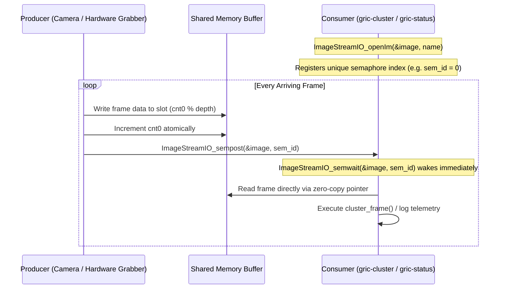

# Shared Memory & Real-Time IPC Guide

This document describes the shared-memory architecture and inter-process communication (IPC)
protocols implemented via **ImageStreamIO** in the GRIC suite.

---

## 1. Overview & Use Case

In extreme adaptive optics (ExAO) and high-speed telemetry applications, sensor data must be
ingested, clustered, and queried with sub-millisecond latencies. Passing frame data through
network sockets or UNIX pipes incurs context-switch overhead and memory copying.

GRIC leverages **ImageStreamIO** shared memory (`/dev/shm/` POSIX memory-mapped files) to achieve
zero-copy circular buffering between hardware frame grabbers, clustering engines, and visualization
dashboards.

---

## 2. Memory-Mapped Circular Layout

An ImageStreamIO stream resides in `/dev/shm/<stream_name>.im.shm` and contains a structured
header followed by a multi-frame circular buffer:

```
+-------------------------------------------------------------------+
| IMAGE_METADATA Header                                             |
|   - atime, writetime, cnt0 (frame counter), cnt1                  |
|   - naxis (dimensionality: [width, height, depth])                |
|   - datatype (FLOAT, DOUBLE, INT16, etc.)                         |
|   - sem (number of registered consumer semaphores)                |
+-------------------------------------------------------------------+
| Frame 0 Data Buffer [width * height * sizeof(type)]               |
+-------------------------------------------------------------------+
| Frame 1 Data Buffer [width * height * sizeof(type)]               |
+-------------------------------------------------------------------+
| ...                                                               |
+-------------------------------------------------------------------+
| Frame (depth - 1) Data Buffer                                     |
+-------------------------------------------------------------------+
```

### Frame Indexing
The current active frame slot within the circular buffer is derived directly from the
hardware counter:

$$\text{slot\_index} = \text{cnt0} \pmod{\text{depth}}$$

---

## 3. Semaphore Synchronization Protocol

ImageStreamIO provides low-latency POSIX semaphore signaling across independent processes:



---

## 4. Lifecycle Management & Cleanup

1. **Producer Stream Creation**:
   ```c
   IMAGE stream;
   uint32_t dims[3] = {width, height, depth};
   ImageStreamIO_createIm_gpu(&stream, "stream_name", 3, dims, _DATATYPE_FLOAT, -1, 10, 0, 0);
   ```
2. **Consumer Attachment**:
   ```c
   IMAGE stream;
   ImageStreamIO_openIm(&stream, "stream_name");
   ```
3. **Graceful Deallocation**:
   Always close consumer handles on shutdown or error:
   ```c
   ImageStreamIO_closeIm(&stream);
   ```
   The producer process is responsible for destroying the stream when terminating:
   ```c
   ImageStreamIO_destroyIm(&stream);
   ```

---

## 5. Developer Pitfalls & Best Practices

* **Stale SHM Files**: If a process crashes without calling `ImageStreamIO_destroyIm()`,
  stale files remain in `/dev/shm/*.im.shm`. Tests must clean up their streams upon completion.
* **Non-Blocking Ingestion**: When processing streams faster than real time, use
  `ImageStreamIO_semtrywait()` rather than blocking indefinitely to avoid hanging during pause.
* **Atomic Counter Sampling**: When reading `cnt0`, ensure 64-bit alignment to avoid torn reads
  across CPU sockets.
