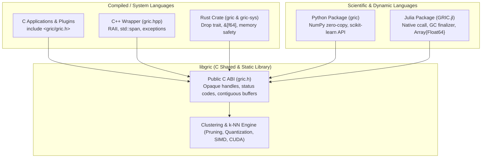

# Library & APIs Overview

While the `gric-cluster` and `gric-knn` command-line executables offer turnkey clustering and search
workflows for batch files and streams, **GRIC** also provides a unified, zero-copy native library:
**`libgric`**.

`libgric` exposes the core online clustering and geometry engines directly in memory, enabling
real-time sensor processing, adaptive optics feedback loops, and integration into larger analytical
pipelines across multiple programming languages.

---

## 1. Supported Languages & Ecosystem

Every language interface connects directly to the high-performance C engine (`libgric`), ensuring
identical algorithmic pruning efficiency and hardware SIMD acceleration across all environments:

---

## 2. CLI vs. Library Comparison

| Feature | CLI (`gric-cluster`) | Library (`libgric` / C, C++, Python, Rust, Julia) |
| :--- | :--- | :--- |
| **Data Ingestion** | Files (ASCII `.txt`, `.fits`, SHM stream) | Direct in-memory pointers / arrays / tensors |
| **Execution Model** | Single-shot process | Persistent engine handle across lifetime |
| **Frame Latency** | Milliseconds (process spawn & disk I/O) | **Microseconds** (in-memory pointer invocation) |
| **Memory Copies** | File reading & parsing overhead | **Zero-copy** raw buffer access |
| **Control** | Command-line flags, config files | Programmatic object configuration & callbacks |
| **Integration** | Subprocess invocation, pipe parsing | Native linking, direct function calls |

---

## 3. Core Concepts

### Opaque Handles & Safe Lifecycle
All state in `libgric` is encapsulated in an opaque handle `gric_cluster_t`. Downstream bindings
never manipulate internal structs directly:
* **Creation**: `gric_cluster_create()` or `gric_cluster_create_simple()`
* **Ingestion**: `gric_cluster_feed_frame()` or `gric_cluster_feed_batch()`
* **Destruction**: `gric_cluster_destroy()`

Higher-level language bindings (C++, Rust, Python, Julia) wrap this handle with **RAII**
(Resource Acquisition Is Initialization), ensuring that memory is deterministically freed when
objects exit scope or are garbage collected.

### Precision & Quantization
The library supports single-precision float and double-precision arithmetic. It incorporates the
exact same quantization and acceleration modes available in the CLI:
* **Scalar Quantization**: 8-bit (`sq8`) and 16-bit (`sq16`) pruning
* **E8 Lattice Quantization**: 16-bit (`eq16`) vector quantization
* **Metric Pruning**: 4-point (`te4`) and 5-point (`te5`) triangle inequalities
* **Entropy Search**: Information-gain guided target selection (`entropy_mode`)

---

## 4. Quick Language Links

* [C API Reference](c.md) — Function declarations, handles, and return codes.
* [C++ API Reference](cpp.md) — Header-only RAII wrapper and exception safety.
* [Python Package](python.md) — NumPy buffer protocol and scikit-learn compatibility.
* [Rust Crate](rust.md) — Safe, idiomatic Rust bindings with Cargo.
* [Julia Package](julia.md) — Direct `ccall` integration with Julia arrays.
* [Build & Integration](integration.md) — CMake `find_package` and pkg-config.
* [Multi-Language Examples](examples.md) — Side-by-side code recipes for all languages.
